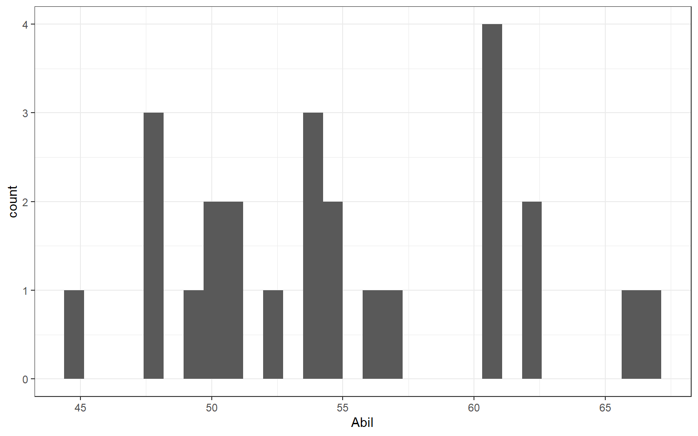
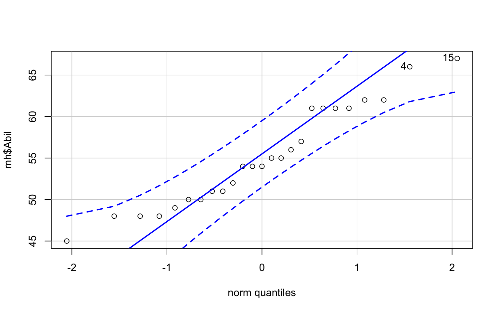
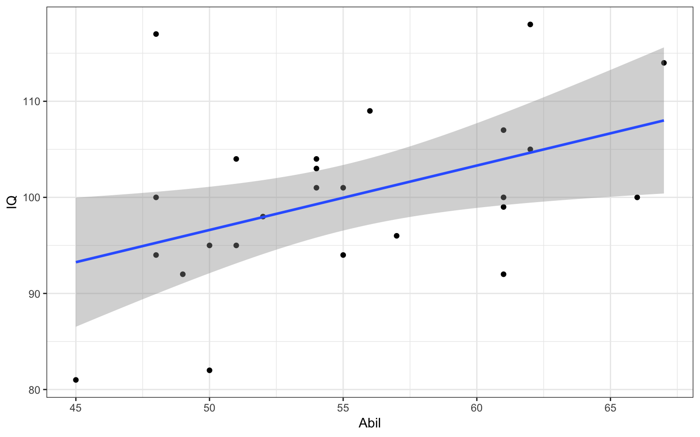
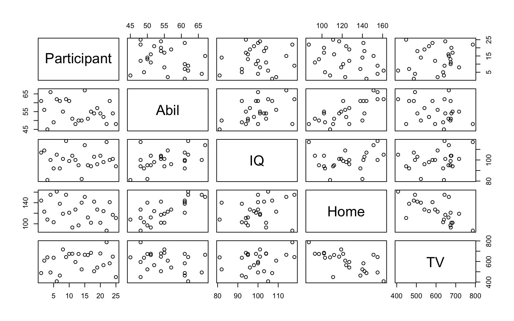

# RM2 R Markdown & Correlations

## Pre-class activities 

Welcome back to Research Methods 2! In this pre-lab we're going to start off nice and slowly by reviewing what R Markdown can do and showing you a few new features. 

### Activity 1: Revise

Ensure that you are comfortable with the terminology, functions and analyses presented in the RM1 labs, and review those chapters if necessary.

You should be able to:  

* Load a .csv file into R  
* Wrangle the data using `filter()`, `select()`, `arrange()`, `mutate()`, `group_by()`, and `summarise()`  
* Calculate descriptive statistics for a dataset for different groups  
* Conduct a chi-square analysis  
* Produce a bar plot of frequency data using `ggplot2()`  

### R Markdown

A key goal of any researcher is to carry out an experiment and to tell others about it. One of the main ways we as Psychologists do this is through publication of a journal article. There are numerous ways that people combine different software to create a journal article, but a more recent innovation in the field is to create reports and articles through R Markdown. If you like, you can see an example from a research team in our school in [this recent PLOS article](http://journals.plos.org/plosone/article?id=10.1371/journal.pone.0185093). A link within the article methods section ([this one](https://osf.io/eb9dq/)) allows you to see the one file that creates the whole manuscript. You wont be writing full journal articles just yet but as in RM1 you will use R Markdown to complete your portfolio R exercises and you will also use R Markdown to submit your mini-project pre-registration so we want to ensure that you are familiar and comfortable with the format.

### Advantages of using R Markdown

1. The output is one file that includes figures, text and citations. No additional files are needed so it's easy to keep all your work in one place. 

2. R code can be put directly into a R Markdown report so it is not necessary to keep your writing (e.g. a Word document) and your analysis (e.g. your R script) separate.  

3. Including the R code directly lets others see how you did your analysis - this is a good thing for science! It is both reproducible and open!  

4. You write your report in normal text so it's not necessary that you learn any new coding such as HTML.  

If at any point you are unsure about how to do something remember to think about where you can get help. There is an **R Markdown Cheatsheet** on the top menu under `Help >> Cheatsheets` or do what we do, Google it. For example, if I forget how to put words in bold, I could simply go to Google and type "**rmarkdown bold**" and no doubt get a lot of useful hints. You can also refer to Chapter \@ref(ref2.

### Activity 2: Create a new Markdown document

Some of the information contained in these activities will repeat what we have already shown you in RM1, however, repetition of the basics is not a bad thing and we're also going to be adding in a few new details and features.

* Create a new R Markdown file (`.Rmd`) by opening R Studio, and then on the top menu, selecting `File >> New File >> R Markdown...`. You should now see the following dialogue box:  

<div class="figure" style="text-align: center">

<p class="caption">(\#fig:img-dialog).Rmd dialog box</p>
</div>

* Click `Document` on the left-hand panel and then give your document a **Title**. This is your file so call it what you want but make sure it is informative to you and your reader. Put your student ID in the **Author** field. For now we will focus on making an **HTML** output, so make sure that is selected as shown and then hit `OK` when you have done so. You should now have an .Rmd file open in R Studio.

### Activity 3: Setting up the new Markdown document

The first thing you will see in your R Markdown file is a header section enclosed at the top and bottom by `---`, that lists the title, author, date and output format (html here). Like this:  

<div class="figure" style="text-align: center">

<p class="caption">(\#fig:img-headers).Rmd header</p>
</div>

By default the file header includes the above info shown but there are many other options available for different functions and formatting that you can look at if you would like to push yourself:
* [Additional HTML options](http://rmarkdown.rstudio.com/html_document_format.html)  
* [Additional .pdf options](http://rmarkdown.rstudio.com/pdf_document_format.html)  

**BUT WAIT**, what if you got your GUID wrong? How would you change this? The long way would be to close the file and start again. The shorter way would be to just correct the info in the header - just remember to keep between the quotes.

### Activity 4: New code chunks

Immediately below the header information you will see the standard default **code chunk**. 

<div class="figure" style="text-align: center">

<p class="caption">(\#fig:img-default-chunk)Default chunk</p>
</div>

In R Markdown you can type any text you want directly in the document just as you would in a word document. However, if you want to include code you need to include it in a **code chunk**. Code chunks start with a line that contains three backwards apostrophes (these are called grave accents - often in the top-left of keyboards) and then includes a set of curly brackets with the letter r inside: 

\`\`\`{r}

\`\`\`

You will **always** need both of these parts to create a code chunk:  

* The three back ticks are the part of the Rmd file that says this is code being inserted into my document. 
* The \`{r}\` part says that you are specifically including R code. 
    
The standard default code chunk provides some basic set-up options for your R Markdown file for when it `knits` your work. For now, it is best to leave this particular code chunk alone. Instead we will show you how to use R Markdown by editing the code chunks that come after this default chunk. 

The next code chunk in your file will look like this below.

<div class="figure" style="text-align: center">

<p class="caption">(\#fig:img-chunk1)Chunk 1</p>
</div>

You can see on the first line of the example chunk above (line 18) that the word `cars` is included after the letter `r` within the curly brackets. This is simply the **name** or the **label** for the code chunk and it really could have been called anything. For example, you could have called this code chunk `cars1` and a later chunk `cars2` to show it was the first and second chunk relating to cars. You don't need to include a label, you can just start your code chunk with `{r}` and it will work fine. However, if you do put in names for the chunks **do not use the same name twice** as this will cause your script to crash when you knit it, e.g. Do not use `data` and `data`; instead maybe use `personality_data` and `participant_info` or whatever makes sense to what you are doing in the chunk.

<div class="try">
<p>cat(“Remember knitting just means converting or rendering your file as a pdf, webpage, etc.. Crashing means that you had an error in your code that stopped your knitting from working or finishing. You can usually find the problem line of code from the error message you’ll see.”)</p>
</div>

The second line (line 19) in the above **code chunk** is the r code we have written: `summary(cars)`. In this case, we are just asking for a `summary()` of the inbuilt dataset `cars`. R Studio has a lot of inbuilt datasets for you to practice on, `cars` is one of these.

The third line (line 20) closes off the code chunk, again with the three backwards apostrophes. This means that whatever is contained between the first and third lines will be code that will run.  

### Activity 5: Knit your code

Now would be a good time to try knitting your file to see what the code chunks do. You can do this using the **Knit button** at the top of the R Studio screen:

<div class="figure" style="text-align: center">

<p class="caption">(\#fig:img-knitting)Knitting</p>
</div>

When you click `Knit`, if you haven't already saved the Rmd file it will ask you to save. Just like in RM1, create a new folder for each lab, call the file `RM2Psych_Chapter5_Preclass.Rmd` and save it in your RM2 Chapter 5 folder. When working in the Psychology labs or the University Library you need to save in a location or drive space that you have full access to and can save files to. The best one on campus is your `M:` drive. If using your own device then anywhere you can save the file should work.

After saving the file a webpage should appear. The first thing to notice is that some lines in the code chunks have disappeared: the \`\`\`{r} and the closing \`\`\` in your code chunk have gone.

<div class="figure" style="text-align: center">

<p class="caption">(\#fig:img-summary)Displaying code</p>
</div>

Whenever you knit an R Markdown file these lines will disappear leaving only the code within. You'll also notice that the output of the code is also now showing in your webpage. In the next section we will show you how to control showing the data or not through adding rules.

<div class="figure" style="text-align: center">

<p class="caption">(\#fig:img-summary2)Code and output</p>
</div>

### Activity 6: Adding rules to code chunks

It can often be a good idea or even necessary to show the data or the outcome of a test in your report, for example if you were writing a report and wanted to include a table of results. But what if your code displayed a table that was 10,000 lines long? In that case you might want to not show the output and only show the code. You can do this by including a rule within the first line of your code chunk - your \`\`\`{r name, rule = option} line. You have already seen a rule before in the standard default chunk, the `include` rule, but there are a number of others.  

**To hide the output but show the code** use the `results = "hide"` rule:

<div class="figure" style="text-align: center">

<p class="caption">(\#fig:img-hide)Hiding output from knitted output</p>
</div>

* Add this rule into your example code chunk, as shown above, and knit the file again. What happens? Note that there is a comma separating the name of the chunk and the rule. You should now see the code only and not the data.

Alternatively, you can **hide the code, but show the output** by using the `echo = FALSE` rule:   

<div class="figure" style="text-align: center">

<p class="caption">(\#fig:img-echo)Hiding code from knitted output</p>
</div>

* In your template .Rmd file the rule echo is set to `FALSE` meaning to show the figure and not the code. Change the rule in your code to `echo` and set it as `TRUE`, then knit the file again. What happens?  

<div class="try">
<p>The "echo = FALSE" option is useful for commands like <code>library()</code> when you are just calling a package into the library but don’t necessarily want to display that in your final report or in your final HTML file. Another example might be if you wanted to make a plot but didn’t want to include the code, you just want to show the plot in your report.</p>
</div>
 
<br> 
You might want to **hide both the code AND the output** by using the `include` rule:

<div class="figure" style="text-align: center">

<p class="caption">(\#fig:img-include)Hiding both code and output</p>
</div>

* Change the rule to your example code chunk, as shown above, to `include = FALSE` and then knit the file again*. What happens? Note that here the code still runs. It just does not show you anything. 

Finally, you can use the `eval` rule which specifies whether or not you want the code chunk you have written to be evaluated when you knit the R Markdown file. Evaluated means to run or carry out the code. Here, the `eval = FALSE` rule will stop the code from being evaluated. The code will be shown because there is no rule stopping it but there will be no output because it won't get evaluated because of the `eval` rule being `FALSE`. 

<div class="figure" style="text-align: center">

<p class="caption">(\#fig:img-eval)Stopping code evaluation</p>
</div>

This might be useful in cases where you want to show the code relating to how you programmed your stimuli for an experiment, but you don't necessarily want it to run as part of the R Markdown file. 

### Activity 7: Formatting the R Markdown File

When you're not writing in code chunks you can format your document in lots of different ways just like you would in a Word document. The [RMarkdown cheatsheet](https://www.rstudio.com/wp-content/uploads/2015/02/rmarkdown-cheatsheet.pdf) provides lots of information about how to do this but we will show you a couple of things that you might want to try out. 

For example, we can make some text **bold** by including two \*\* (two asterisks) at the start and end of the text we want to present in bold font. 

<div class="figure" style="text-align: center">

<p class="caption">(\#fig:img-bold)Bold formatting</p>
</div>

* Write some text in your Rmd file and put it in bold. Knit the file to check it worked.   

* You can also use italics by putting a single \* (asterisk) at the start and end of the word or sentence. Try this now.  

Finally, you might want to add headings and sub-headings to your file. For example, maybe you are writing a Psychology journal article and want to put in a header for the Introduction, Methods, Results, or Discussion sections. We do this using the # (hash-tag) symbol.

<div class="figure" style="text-align: center">

<p class="caption">(\#fig:img-hashtag)Hashtag headings</p>
</div>

* Type the four main headings found in a Psychology journal article in your R Markdown file, typing each one in a separate line. These are mentioned above. Knit the file. What do these look like? 

* Now add a different number of #'s before each heading, with a space between the heading and the hashtag (e.g. # Introduction) and knit the file again. What do you notice about the different number of hash-tags?  

#### Finished!

And you're done with the pre-lab! The key aim of this pre-lab is to get you feeling comfortable with R Markdown and to give you time to recap the content covered in RM1. In each lab for RM2 we will introduce new statistical analyses, however, each week we will also practice the same wrangling skills you have learned so far.

### Test yourself

You've got a large dataset of thousands of participant's personality and happiness scores that you want to analyse and present in R Markdown.

1. You want to show the code you are running in your analysis but not show the output as this would be too much to display. Note that you want the code to run. Type in the box (e.g. `rule = "set"`) how you would set the `results` rule to do this? <input class='solveme nospaces' size='20' data-answer='["results = \"hide\""]'/>

2. You create a plot of happiness versus neuroticism scores but you want to hide the code and only show the output. How can you do this? <select class='solveme' data-answer='["echo = FALSE"]'> <option></option> <option>echo = TRUE</option> <option>include = FALSE</option> <option>code = HIDE</option> <option>echo = FALSE</option></select>


<div class='solution'><button>Explain these answers</button>

The first answer should be results = "hide" as you want to show the code and run the code but not necessarily show the output of the code. Remember that "hide" needs to be in quotation marks.
    
In the second question, "include = FALSE" technically would hide the code, but this also hides the output! "echo = FALSE" allows you to still see your plot while hiding the code you want hidden. "code = HIDE" - if only it were that simple! The aim of these questions aren't to help you memorise these codes (no one can do that!), they're to help you gain a better understanding of how to apply these codes when you come across them in the future.

</div>
  
<br>  

3. True or False: writing `echo = TRUE` has the same effect on the output of a code as if you had no echo rule at all: <select class='solveme' data-answer='["TRUE"]'> <option></option> <option>TRUE</option> <option>FALSE</option></select>


<div class='solution'><button>Explain this</button>

All of the rules have a default mode. For example, `echo`, `include`, and `eval` are usually by default set to `TRUE`. As a result, if you don't declare any `echo` rule, i.e. you don't declare `echo = FALSE`, then it is the same as declaring `echo = TRUE`. So no rule means that you are wanting that rule set as `TRUE`.

</div>
  
<br>  

4. True or False: there is no difference between the rules `results = "hide"` and `eval = FALSE` as they both hide the output: <select class='solveme' data-answer='["FALSE"]'> <option></option> <option>TRUE</option> <option>FALSE</option></select>


<div class='solution'><button>Explain this</button>

In the first rule, `results = "hide"`, the code is evaluated and results are produced but the output is hidden. In the second rule, `eval = FALSE`, the code is not evaluated and therefore no results or output has been produced. If you need your output for a later part of the code then you would use the `results` rule. If you don't need the output and just want to show the code as an example then you would use the `eval` rule.

</div>
  

<br>

5. If \* puts words into italics, and \*\* puts words into bold, type in the box what might you put before (and technically after) a word to put it into italics with bold? <input class='solveme nospaces' size='3' data-answer='["***"]'/>

6. True or False: The **more** '#'s you include, the **smaller** the header is: <select class='solveme' data-answer='["TRUE"]'> <option></option> <option>TRUE</option> <option>FALSE</option></select>  


<div class='solution'><button>Explain this</button>

If * at the start and end of the word puts it in italics (e.g. *italics*) and ** puts it in bold (e.g. **bold**), then putting three *** at the start and end will put it in italics with bold (e.g. ***italics-bold***).
    
It is true that the more #'s you use, the smaller the heading is. Word and other document writers use different headings as well. Here, # gives the biggest heading, and it gets smaller and smaller with every extra #.

    

</div>
  
<br> 

## In-class activities

### Correlations

As [Miller and Haden (2013)](https://drive.google.com/file/d/0B1fyuTuvj3YoaFdUR3FZaXNuNXc/view) state at the start of Chapter 11, correlations are **used to detect and quantify relationships among numerical variables**. In short, you measure two variables and the correlation analysis tells you whether or not they are related in some manner - positively or negatively; one increases as the other increases; one decreases as the other increases; etc.. 

To actually carry out a correlation is very simple and we will show you that today in a little while: you just need the `cor.test()` function.  The harder part of correlations is really wrangling the data and interpreting what the results mean. You are going to run a few correlations today to give you good practice at running and interpreting the relationships between two variables. 

**Note:** When dealing with correlations you should always refer to relationships and not predictions. In a correlation, X does not predict Y, that is regression which we will look at later this semester. In a correlation, all we can say is whether X and Y are related. So try to get the correct terminology and please feel free to pull us up if we say the wrong thing in class. It is an easy slip of the tongue to make!

### Activity 1: Set-up

In this lab we will use the examples in Miller and Haden (2013), Chapter 11, looking at the relationship between four variables: reading ability, intelligence (IQ), the number of minutes per week spent reading at home (Home); and the number of minutes per week spent watching TV at home (TV). You can see in this situation that it would be unethical to manipulate these variables so measuring them as they exist in the environment is most appropriate; hence the use of correlations.

Do the following. If you need help, consult Chapter \@ref(ref3) and Chapter \@(ref2).

* Open R Studio and set the working directory to your RM2 Chapter 5 folder. Ensure the environment is clear.    
* Open a new R Markdown document and save it in your working directory. Call the file "Chapter 5 In-class".    
* Download <a href="MillerHadenData.csv" download>MillerHadenData.csv</a> and save it in your Chapter 5 folder. Make sure that you do not change the file name at all.  
* If you are working on your own computer, install the packages `Hmisc`, `car`, and `broom`. Remember **do not install packages on university computers, they are already installed**.
* Delete the default R Markdown welcome text and insert a new code chunk that loads the packages `broom`, `car`, `lsr`, `Hmisc`, and `tidyverse` (in that order) using the `library()` function and loads the data into an object named `mh` using `read_csv()`

### Activity 2: Look at your data

* Look at your data, you can do this by clicking on the object in the environment, or using `summary(mh)` or `head(mh)`. 

As in Miller and Haden, we have 5 columns: 

1. The participant (`Participant`), 
2. Reading Ability score (`Abil`), 
3. Intelligence score (`IQ`), 
4. Number of minutes spent reading at home per week (`Home`), 
5. And number of minutes spent watching TV per week (`TV`). 

For the lab we will focus on Reading Ability and IQ but for further practice you can look at other relationships in your free time.  
A probable hypothesis for today could be that as Reading Ability increases so does Intelligence (think of the issue with causality and direction). Phrasing the hypothesis more formally, we hypothesise that the reading ability of school children, as measured through a standardized test, and intelligence, again measured through a standardized test, are positively correlated.  

### Activity 3: Assumptions

First, however, we must check some assumptions of the correlation tests. The main assumptions we need to check are:

1. Is the data interval, ratio, or ordinal?
2. Is there a data point for each participant on both variables?
3. Is the data normally distributed in both variables?
4. Does the relationship between variables appear linear?
5. Does the spread have homoscedasticity?

We will look at these in turn.

#### Assumption 1: Level of Measurement
If we want to run a Pearson correlation then we need interval or ratio data; Spearman correlations can run with ordinal, interval or ratio data. What type of data do we have?  

* The type of data in this analysis is most probably <select class='solveme' data-answer='["interval"]'> <option></option> <option>ratio</option> <option>interval</option> <option>ordinal</option> <option>nominal</option></select> as the data is <select class='solveme' data-answer='["continuous"]'> <option></option> <option>continuous</option> <option>discrete</option></select> and there is unlikely to be a true zero


<div class='solution'><button>Hints on data type</button>


* Are the variables continuous? 
* Is the difference between 1 and 2 on the scale equal to the difference between 2 and 3?

</div>
  

#### Assumption 2: Pairs of Data
All correlations must have a data point for each participant in the two variables being correlated. This should make sense as to why - you can't correlate against an empty cell! So now go check that you have a data point in both columns for each participant. 

It looks like that everyone has data in all the columns but let's test our skills a little whilst we are here.  Answer the following questions:

1. How is missing data represented in a tibble? <select class='solveme' data-answer='["NA"]'> <option></option> <option>an empty cell</option> <option>NA</option> <option>a large number</option> <option>don't know</option></select>
2. Which code would leave you with just the participants who were missing Reading Ability data in mh: 
<select class='solveme' data-answer='["filter(mh, is.na(Abil)"]'> <option></option> <option>filter(mh, is.na(Ability)</option> <option>filter(mh, is.na(Abil)</option> <option>filter(mh, !is.na(Ability)</option> <option>filter(mh, !is.na(Abil)</option></select>
3. Which code would leave you with just the participants who were not missing Reading Ability data in mh: <select class='solveme' data-answer='["filter(mh, !is.na(Abil)"]'> <option></option> <option>filter(mh, is.na(Ability)</option> <option>filter(mh, is.na(Abil)</option> <option>filter(mh, !is.na(Ability)</option> <option>filter(mh, !is.na(Abil)</option></select>


<div class='solution'><button>Hints on removing missing data points</button>


* `filter(dat, is.na(variable))` versus `filter(dat, !is.na(variable))`

</div>
  

#### Assumption 3-5: Normality, linearity, homoscedasticity

The remaining assumptions are all best checked through visualisations. You can use histograms and QQ-plots to check that the data (`Abil` and `IQ`) are both normally distributed, and you can use a scatterplot of IQ as a function of Abil to check whether the relationship is linear, with homoscedasticity, and without outliers. There are various options and tests for assessing these assumptions but today we will just use visual checks.

* Run the below code to create a histogram for `Abil`.


```r
ggplot(data = mh, aes(x = Abil)) +
  geom_histogram()
```

<div class="figure" style="text-align: center">

<p class="caption">(\#fig:abil_hist)Histogram of Abil</p>
</div>

This code should look very similar to the code you used to create a bar plot in Chapter \@(bar). We have specified that we want to display `Abil` on the x-axis and that the shape we want to produce is a histogram, hence `geom_histogram()`. Just like `geom_bar()`, you do not need to specify the y-axis because if it's a histogram, it's always a count.

* Write and run the code to produce another histogram for the variable `IQ`.

The QQ-plots require us to use the package `car` rather than `ggplot2`. You can make QQ-plots in `ggplot2` but they aren't as useful, however, the code is still very simple.

* Run the below code to create a QQ-plot for `Abil`.


```r
qqPlot(x = mh$Abil)
```

<div class="figure" style="text-align: center">

<p class="caption">(\#fig:qq_abil)QQ-plot for Abil</p>
</div>

```
## [1] 15  4
```

The QQ-plot includes a **confidence envelope** (the blue dotted lines). The simple version is that if your data points fall within these dotted lines then you can assume normality. The `ggplot2` version of QQ-plots make it more difficult to add on this confidence envelope, which is why we're using a different package. `qqPlot()` will also print the IDs of the data points that are potentially problematic. In this case, the 4th and 15th data point in `Abil` are flagged to review.

* Write and run the code to create a QQ-plot for `IQ`.

In order to assess linearity and homoscedasticity, we can create a scatterplot using `ggplot2`. This code is slightly different to what you have already done with `ggplot()` in that with a scatterplot you need to specify both the x and y axis in `aes()`.

The first geom, `geom_point()` adds in the data points, the second geom, `geom_smooth` adds in the line of best fit. The shaded area around the line is a **confidence interval**.


```r
ggplot(data = mh, aes(x = Abil, y = IQ)) +
  geom_point()+
  geom_smooth(method = lm) # if you don't want the shaded CI, add se = FALSE to this
```

<div class="figure" style="text-align: center">

<p class="caption">(\#fig:unnamed-chunk-11)**CAPTION THIS FIGURE!!**</p>
</div>

* Remember that `ggplot2` works on layers and that you customise each layer. Edit the above code to add in layer of `scale_x_continuous()` that changes the label `Abil` to `Reading Ability`.

Based on the above visualisations:

* Is the assumption of normality met for both variables? <select class='solveme' data-answer='["Yes"]'> <option></option> <option>Yes</option> <option>No</option></select>
* Is the assumption of linearity met for both variables? <select class='solveme' data-answer='["Yes"]'> <option></option> <option>Yes</option> <option>No</option></select>
* Is the assumption of homoscedasticity met for both variables? <select class='solveme' data-answer='["Yes"]'> <option></option> <option>Yes</option> <option>No</option></select>


<div class='solution'><button>Explain these answers</button>

When assessing assumptions through the use of visualisations your decision will always be a judgement call. In this dataset, we only have data from 25 participants therefore it is very unlikely we would ever observe perfect normality and linearity in this dataset. It is likely that a researcher would assume that this data is approximately normal, that there is no evidence of a non-linear relationship, and that the spread of data points around the line is relatively even.

Many students become fixated with needing a 'perfect' dataset that follows an exactly normal distribution. This is unlikely to ever happen with real data - learn to trust your instincts!
    

</div>

<br>

Look at the scatterplot and think back to the lecture, how would you describe this correlation in terms of direction and strength? 

### Activity 4: Descriptive statistics

Many researchers (and indeed members of the School of Psychology!) disagree as to whether you need to report descriptive statistics such as the mean and SD for a correlation. The argument against reporting them is that the scatterplot is actually the descriptive of the correlation that you would use to describe the potential relationship in regards to your hypothesis. 

The counter argument is that providing descriptive statistics can still be informative about the spread of data for each variable, for example, in the current example it would make it easier to understand whether the participants as a whole compare to the population IQ score.

There's no fixed answer to this question but the person writing this book takes the second view that you should always report descriptive statistics so that's what we're going to do.

* Calculate the mean score and standard deviation for `Abil` and `IQ` using `summarise()` 
* Name the output of the calculations `Abil_mean`, `Abil_SD`, `IQ_mean`, and `IQ_SD`. Make sure to use these exact spellings otherwise later activities won't work.
* Store the output of this in an object called `descriptives` and then view the object. It should look something like this:  


 Abil_mean    Abil_SD    IQ_mean    IQ_SD 
-----------  ---------  ---------  -------
   55.12       6.08      100.04     9.04  


### Activity 5: Correlation

Finally we will run the correlation using the `cor.test()` function.  Remember that for help on any function you can type `?cor.test` in the console window.  The `cor.test()` function requires:

* the column name of Variable 1
* the column name of Variable 2
* the type of correlation you want to run: e.g. `pearson`, `spearman`
* the type of NHST tail you want to run: e.g. `one.sided`, `two.sided`

For example, if your data is stored in `dat` and you want to do a two-sided pearson correlation of the variables (columns) `X` and `Y`, then you would do:


```r
cor.test(dat$X, dat$Y, method = "pearson", alternative = "two.sided")
```

* Based on your answers to the assumption tests, spend a couple of minutes deciding with your group which correlation method to use (e.g. pearson or spearman) and the type of NHST tail to set (e.g. two.sided or one.sided). 
* Run the correlation between IQ and Ability and save it in an object called `results`.
* View the output by typing `results` in the console

As you can see from the environment, the output from the correlation has saved as a list. This can make it a little more difficult to work with so we're going to use a function from the `broom` package that we loaded to make the table a bit tidier. The following code is going to overwrite the object results with the tidy version.

* Run the below code and then view the object by clicking on `results` in the environment.


```r
results <- results %>% # take the object results and then
  tidy()              # tidy it up
```

### Activity 6: Interpreting the correlation 

You should now have a tibble called `results` that gives you the output of the correlation between Reading Ability and IQ for the school children measured in Miller and Haden (2013) Chapter 11. All that is left to do now, is interpret the output. 

Look at `results`and then with your group, answer the following questions:

1. What is the value of Pearson's *r* to 2 decimal places? <input class='solveme nospaces' size='20' data-answer='[".45"]'/>
2. The direction of the relationship between Ability and IQ is: <select class='solveme' data-answer='["positive"]'> <option></option> <option>positive</option> <option>negative</option> <option>no relationship</option></select>
3. The strength of the relationship between Ability and IQ is: <select class='solveme' data-answer='["medium"]'> <option></option> <option>strong</option> <option>medium</option> <option>weak</option></select>
4. Based on $\alpha = .05$ the relationship between Ability and IQ is: <select class='solveme' data-answer='["significant"]'> <option></option> <option>significant</option> <option>not significant</option></select>
5. The hypothesis was that the reading ability of school children, as measured through a standardized test, and intelligence, again through a standardized test, are positively correlated. Based on the results we can say that the hypothesis: <select class='solveme' data-answer='["is supported"]'> <option></option> <option>is supported</option> <option>is not supported</option> <option>is proven</option> <option>is not proven</option></select> 


<div class='solution'><button>Explain these answers</button>


1. The test statistic, in this case the r value, is usually labelled as the `estimate`.
2. If Y increases as X increases then the relationship is positive. If Y increases as X decreases then the relationship is negative. If there is no change in Y as X changes then there is no relationship
3. Depending on the field most correlation values greater than .5 would be strong; .3 to .5 as medium, and .1 to .3 as small. 
4. The field standard says less than .05 is significant and our p-value is less than .05.
5. Hypotheses can only be supported or not supported, never proven. In this case, our results matched our hypothesis therefore it is supported.

</div>
  

### Activity 7: Write-up

Copy and paste the below **exactly** into **white space** in your R Markdown document and then knit the file. 


```r
The mean IQ score was `r round(pluck(descriptives$IQ_mean),2)` (`r round(pluck(descriptives$IQ_SD),2)`) and the mean reading ability score was `r round(pluck(descriptives$Abil_mean),2)` (`r round(pluck(descriptives$Abil_SD),2)`). A Pearson\`s correlation found a significant, medium positive correlation between the two variables (r (`r results$parameter`) = `r round(results$estimate, 2)`, *p* = `r round(results$p.value, 3)`).
```

It will magically transform into:

>The mean IQ score was 100.04(9.04) and the mean reading ability score was 55.12(6.08). A Pearson\`s correlation found a significant, medium positive correlation between the two variables (r (23) = 0.45, *p* = 0.024)

### Activity 8: Scatterplot matrix

Above we ran one correlation and if we wanted to do a different correlation then we would have to edit the `cor.test()` line and run it again. However, when you have lots of variables in a dataset, to get a quick overview of patterns, one thing you might want to do is run all the correlations at the same time or create a matrix of scatterplots at the one time. You can do this with functions from the `Hmisc` and `lsr` packages. We will use the Miller and Haden data here again which you should still have in a tibble called `mh`. 


* Run the following line. The `pairs()` function from the `Hmisc` library creates a matrix of scatterplots which you can then use to view all the relationships at the one time.


```r
pairs(mh)
```

<div class="figure" style="text-align: center">

<p class="caption">(\#fig:pairs)Scatterplot matrix</p>
</div>

Notice something wrong? `pairs()` will create scatterplots for **all** variables in your data (as will `correlate()` below). This means that it has correlated the Participant ID number as well, which is totally meaningless.

* Overwrite `mh` and use `select()` to get rid of the `Participant` column then run `pairs(mh)` again.


### Activity 9: Multiple correlations

To perform multiple correlations in one go, we will use the `correlate()` function from the `lsr` package. If you look at the help documentation for `correlate()` you will see that it takes the following form:


```r
correlate(x, y=NULL, test=FALSE, corr.method="pearson", p.adjust.method="holm") 
```

You can use `correlate()` similar to `cor.test()` and specify a specific variable for both `x` and `y` to perform a single correlation. However, you can also provide a data frame that has multiple variables as `x` and it will run all possible correlations between the variables.   

* `test` controls whether or not p-values will be computed. The default setting for this is `FALSE`. You will almost always want to change this to `TRUE`.  
* `corr.method()` controls which correlation is computed, the default is `pearson` but if you needed to run the non-parametric version you could change this to `spearman`.  
* `p.adjust.method` is the reason we are using the `lsr` package. In the lectures we discussed the problem of multiple comparisons - the idea that if you run lots and lots of tests you're likely to produce a significant p-value just by chance. This argument applies a correction to the p-value that adjusts for the number of correlations you have performed. There are several different methods which you can look up in the help documentation, the default setting is a Bonferroni-Holm correction.  
* Because you're running multiple correlations and some may be positive and some may be negative, there is no option to specify a one or two-tailed test.   

There's one last thing we need to do before we run the correlation. `lsr` is an older package and doesn't like working with tibbles, so we need to convert our tibble to a data frame, an older type of object.   

* Run the below code. It will overwrite the tibble `mh` with a data frame.  


```r
mh <- as.data.frame(mh)
```

OK, finally let's run the correlations.  

* Run the below code to calculate then view the correlation results


```r
corr_results <- correlate(x = mh, # our data
                          test = TRUE, # compute p-values
                          corr.method = "pearson", # run a pearson test 
                          p.adjust.method = "holm") # use the holm correction
corr_results
```

`corr_results` is a list with 5 components and you can view each of these separately just like you did with chi-square, for example, trying running the below code to view just the correlation values:


```r
corr_results$correlation
```


1. Is the correlation between `Abil` and `Home` positive or negative? <select class='solveme' data-answer='["Positive"]'> <option></option> <option>Positive</option> <option>Negative</option></select>
2. This means that as `Abil` scores increase, `Home` scores will <select class='solveme' data-answer='["Increase"]'> <option></option> <option>Increase</option> <option>Decrease</option></select>
3. What is the strongest positive correlation? <select class='solveme' data-answer='["Abil * Home"]'> <option></option> <option>Abil * IQ</option> <option>Abil * Home</option> <option>Abil * TV</option></select>
4. What is the strongest negative correlation? <select class='solveme' data-answer='["Home * TV"]'> <option></option> <option>Abil * TV</option> <option>IQ * TV</option> <option>Home * TV</option></select>
5. Is the correlation between `Abil` and `IQ` significant? <select class='solveme' data-answer='["No"]'> <option></option> <option>Yes</option> <option>No</option></select>
6. Is the correlation between `Abil` and `Home` significant? <select class='solveme' data-answer='["Yes"]'> <option></option> <option>Yes</option> <option>No</option></select>
7. How would you describe the strength of the correlation between `Home` and `TV`? <select class='solveme' data-answer='["Strong"]'> <option></option> <option>Weak</option> <option>Medium</option> <option>Strong</option></select>
8. Think back to the lecture. Why are we not calculating an effect size?


<div class='solution'><button>Explain these answers</button>

1. Negative correlations are denoted by a negative r value.  
    2. Positive correlations = as one score goes up so does the other, negative correlations = as one score goes up the other goes down.  
    3 & 4. Remember that correlations take values from -1 - 1 and that the nearer to one in either direction the stronger the correlation (i.e., an r value of 0 would demonstrate a lack of any relationship.  
    5 & 6. The traditional cut-off for significance is .05. Anything below .05 is considered significant. Be careful to pay attention to decimal places.  
    7. Cohen's guidelines recommend weak = 1. - .3, medium = .3 - .5, strong > .5.  
    8. Because r is an effect size.

</div>
  
<br>  


#### Finished!

Well done! You can now add correlations to the list of things you can do in R.This week we will release the first portfolio exercise for RM2 which focuses on correlations. If you have any questions, please post them on the Slack forum.

### Activity solutions

#### Activity 1


<div class='solution'><button>Activity 1</button>


```r
library("broom")
library("car")
library("lsr")
library("Hmisc")
library("tidyverse")
mh <- read_csv("MillerHadenData.csv")
```

</div>
  

**click the tab to see the solution**
<br>

#### Activity 3


<div class='solution'><button>Activity 3</button>


```r
# histogram
ggplot(data = mh, aes(x = IQ)) +
  geom_histogram()

# qqplot
qqPlot(x = mh$IQ)

# edited scatterplot
ggplot(data = mh, aes(x = Abil, y = IQ)) +
  geom_point()+
  geom_smooth(method = lm)+
  scale_x_continuous(name = "Reading Ability")
```

</div>
  

**click the tab to see the solution**
<br>

#### Activity 5


<div class='solution'><button>Activity 5</button>


```r
results <- cor.test(mh$Abil, mh$IQ, method = "pearson", alternative = "two.sided")
```

</div>
  

**click the tab to see the solution**
<br>


#### Activity 8


<div class='solution'><button>Activity 8</button>


```r
mh <- mh %>%
  select(-Participant)
pairs(mh)
```

</div>
  

**click the tab to see the solution**
<br>
