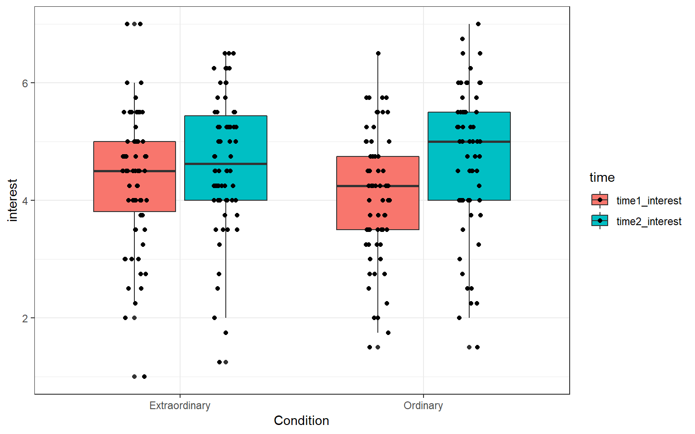
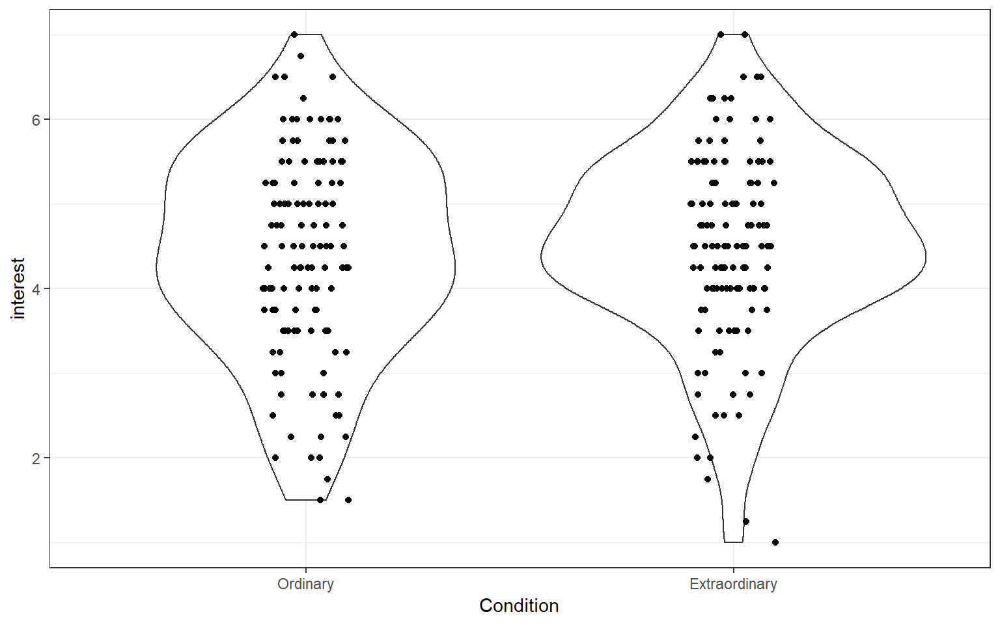
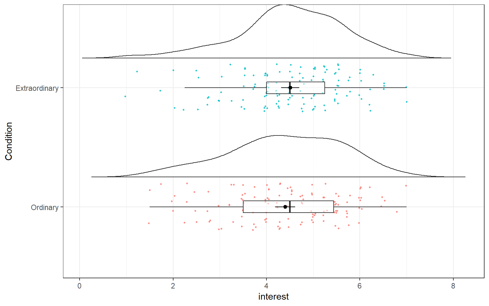

# RM2 Visualisation, power, and effect size {#vis}

## Pre-class activities

In this pre-lab we are going to focus on visualising data using `ggplot2`. You've already created a number of different plots including bar charts, scatterplots, histograms, qq-plots, and violin-boxplots, but now we will show you how to customise your plots further to give you a better idea of the range and flexibility of visualising data in R. 

In this pre-class, you won't be asked to write any code yourself, we will give you all the example code. Instead, play with the arguments, change TRUE to FALSE and vice-versa, change the values and colours. This will help you learn what each bit does. 

For all of the activities in this pre-lab we are going to use data from  Experiment 3 of [Zhang, T., Kim, T., Brooks, A. W., Gino, F., & Norton, M. I. (2014). A "present" for the future: The unexpected value of rediscovery. Psychological Science, 25, 1851-1860.](https://journals.sagepub.com/doi/abs/10.1177/0956797614542274).

To help you understand the data we're visualising, here is the abstract:

> Although documenting everyday activities may seem trivial, four studies reveal that creating records of the present generates unexpected benefits by allowing future rediscoveries. In Study 1, we used a time-capsule paradigm to show that individuals underestimate the extent to which rediscovering experiences from the past will be curiosity provoking and interesting in the future. In Studies 2 and 3, we found that people are particularly likely to underestimate the pleasure of rediscovering ordinary, mundane experiences, as opposed to extraordinary experiences. Finally, Study 4 demonstrates that underestimating the pleasure of rediscovery leads to time-inconsistent choices: Individuals forgo opportunities to document the present but then prefer rediscovering those moments in the future to engaging in an alternative fun activity. Underestimating the value of rediscovery is linked to people’s erroneous faith in their memory of everyday events. By documenting the present, people provide themselves with the opportunity to rediscover mundane moments that may otherwise have been forgotten.

### Activity 1: Set-up

Do the following. If you need help, consult Chapter \@ref(ref3) and Chapter \@(ref2).

* Open R Studio and set the working directory to your Chapter 7 folder. Ensure the environment is clear.   
* Open a new R Markdown document and save it in your working directory. Call the file "Chapter 7 Pre-class".    
* Download <a href="Zhang et al. 2014 Study 3.csv" download>Zhang et al. 2014 Study 3.csv</a> and save it in your Chapter 7 folder. Make sure that you do not change the file name at all.
* Delete the default R Markdown welcome text and insert a new code chunk that loads the package `tidyverse` using the `library()` function. 
* Run the below code to load and wrangle the data into tidy data.


```r
library(tidyverse)
zhang_data <- read_csv("Zhang et al. 2014 Study 3.csv")%>%
  select(Gender, Age,Condition, T1_Predicted_Interest_Composite, T2_Actual_Interest_Composite)%>%
  mutate(subject = row_number())%>%
  gather(key = time,
         value = interest,
         T1_Predicted_Interest_Composite,T2_Actual_Interest_Composite)%>%
  mutate(Condition = recode(Condition, "1" = "Ordinary", "2" = "Extraordinary"))%>%
  mutate(time = recode(time, "T1_Predicted_Interest_Composite" = "time1_interest", "T2_Actual_Interest_Composite" = "time2_interest"),
         Gender = recode(Gender, "1" = "male", "2" = "female")) %>%
  filter(Gender %in% c("male", "female"))
```

### Activity 2: Histograms

First, let's create histograms for `interest` to check the distribution. 
The first line of code creates the `ggplot()` object and specifies which dataset is being used, and what should be represented on the x and y-axis. Because this is a histogram, you only need to specify the variable on the x-axis because y is always frequency

#### Basic histogram

The code below will create a simple histogram with default appearance and no customisation. You wouldn't use this graph in a paper, but if you just want to quickly check your distributions, for e.g., normality, this code might be enough. 


```r
ggplot(zhang_data, aes(interest))+ 
  geom_histogram()
```

<div class="figure" style="text-align: center">

<p class="caption">(\#fig:hist1)Basic histogram</p>
</div>

#### Colour and fill

The next section of code will change the appearance. Plots in ggplot2 are highly customisable - [R for Data Science](https://r4ds.had.co.nz/data-visualisation.html) has an excellent chapter on `ggplot` if you would like additional information. 

Adding `binwidth` to `geom_histogram()` changes the bins of the histogram, i.e., how wide the bars are. The default is 30. Sometimes this may be appropriate but often you will want to change the binwidth. What value you give will depend upon your data.

`colour()` changes the colour of the line around the bars. `fill()` changes the fill of the bars. 


```r
ggplot(zhang_data, aes(x = interest))+ 
  geom_histogram(binwidth = .3, 
                 colour = "black",  
                 fill = "grey") 
```

<div class="figure" style="text-align: center">

<p class="caption">(\#fig:hist2)Histogram with colour changes</p>
</div>

#### Axis labels

The next section of code changes the labels on the graphs. Note that the labels are an additional layer (i.e., it comes after an `+`, rather than being an argument to `geom_histogram()`).

The function you use will depend on your data, the most common are `scale_x/y_continuous` and `scale_x/y_discrete` depending on whether you are displaying continuous or categorical data. Again, each axis is a separate layer. 

These scale functions control all the information about the axis, from the label to the breaks, to the minimum and maximum values. For more information use the help documentation. 

For our labelling purposes, there are two main arguments:

1. `name()` controls the main name of the axis
2. `labels()` controls the name of the breaks  

For our histogram we will just change the main axis labels. 


```r
ggplot(zhang_data, aes(x = interest))+ 
  geom_histogram(binwidth = .3, 
                 colour = "black",  
                 fill = "grey") + 
  scale_x_continuous(name = "Mean interest score (1-7)") +
  scale_y_continuous(name = "Count") 
```

<div class="figure" style="text-align: center">

<p class="caption">(\#fig:hist3)Histogram with label changes</p>
</div>

#### Density curve

The following section adds a normal density curve to the histogram, which can be useful for checking the assumption of normality.

To add the line you must change the `geom_histogram()` to use density on the y-axis (the default is count) and add a `stat_function()` layer that draws the line.


```r
ggplot(zhang_data, aes(interest))+ 
  geom_histogram(binwidth = .3, 
                 colour = "black", 
                 fill = "grey",
                 aes(y = ..density..))+ # change y-axis to density
  scale_x_continuous(name = "Mean interest score (1-7)") +
  scale_y_continuous(name = "Count") +
  stat_function(fun = dnorm, # this adds a normal density function curve
                colour = "red", # this makes it red
                args = list(mean = mean(zhang_data$interest, na.rm = TRUE),
                           sd = sd(zhang_data$interest, na.rm = TRUE)))
```

<div class="figure" style="text-align: center">

<p class="caption">(\#fig:hist4)Histogram with normal density curve</p>
</div>

### Activity 3: Scatterplots

#### Basic scatterplot

Now let's make a scatterplot plotting `Age` and `interest` to see if there is any relationship between the two. We need to specify both the x and y-axis variables. The following code will produce a very simple scatterplot. Again, you wouldn't use this graph in a paper, but for eye-balling your data it would suffice. 


```r
ggplot(zhang_data, aes(x = interest,y = Age))+
       geom_point()
```

<div class="figure" style="text-align: center">

<p class="caption">(\#fig:scat1)Basic scatterplot</p>
</div>

#### Axis labels

From this plot it doesn't look like there is much of a relationship between age and interest ratings. We can now change the labels using the same scale functions as before. 


```r
ggplot(zhang_data, aes(x = interest,y = Age))+
       geom_point()+
  scale_x_continuous(name = "Mean interest score (1-7)") + 
  scale_y_continuous(name = "Age")
```

<div class="figure" style="text-align: center">

<p class="caption">(\#fig:scat2)Scatterplot with label changes</p>
</div>

#### Adding a regression line

It's often useful to add a regression line or line of best fit to a scatterplot. The regression line is added with `geom_smooth()` and by default will also provide a 95% confidence interval. You can specify what type of line you want to draw, most often you will need `method = lm`, i.e., a linear model or a straight line. Look up the help documentation for `geom_smooth()` and see what other methods you can use. 


```r
ggplot(zhang_data, aes(x = interest,y = Age))+
  geom_point()+
  scale_x_continuous(name = "Mean interest score (1-7)") + 
  scale_y_continuous(name = "Age")+
  geom_smooth(method=lm) # if you don't want the shaded CI, add se = FALSE to this
```

<div class="figure" style="text-align: center">

<p class="caption">(\#fig:scat3)Scatterplot with regression line</p>
</div>

#### Grouped scatterplots

We can use ggplot to show how the relationship might differ for different populations within our data. We do this by adding `colour()` to `aes()` and setting it as whatever variable we would like to distinguish between. In this case, we will see how the relationship between age and interest differs for the male and female participants. There are a few participants with missing gender so we will first filter them out.


```r
zhang_data %>%
  filter(Gender %in% c("male", "female")) %>%
           ggplot(aes(x = interest,y = Age, colour = Gender))+
  geom_point()+
  scale_x_continuous(name = "Mean interest score (1-7)") + 
  scale_y_continuous(name = "Age")+
  geom_smooth(method=lm)
```

<div class="figure" style="text-align: center">

<p class="caption">(\#fig:scat4)Grouped scatterplot</p>
</div>

And here's that plot with the labels tidied up. Notice the use of `scale_color_discrete()` to adjust the labels for Gender. 

<div class="warning">
<p>When you change the <code>labels</code>, R will simply overwrite the names in the dataset. If you wanted to actually change the order of the categories (e.g., have male as the red line) you need to change the order of the factor. We will do this later, for now, just be sure that you’re changing the name of the right category (i.e., female comes first))</p>
</div>


```r
ggplot(zhang_data, aes(x = interest,y = Age, colour = Gender))+
  geom_point()+
  scale_x_continuous(name = "Mean interest score (1-7)") + 
  scale_y_continuous(name = "Age")+
  geom_smooth(method=lm)+
  scale_color_discrete(name = "Gender",
                       labels = c("Female", "Male"))
```

<div class="figure" style="text-align: center">

<p class="caption">(\#fig:scat5)Grouped scatterplot with adjusted labels</p>
</div>

### Activity 4: Boxplots

#### Basic boxplot

The following code will produce a simple boxplot for eye-balling your data.


```r
ggplot(zhang_data, aes(x = Condition, y = interest))+
  geom_boxplot()
```

<div class="figure" style="text-align: center">

<p class="caption">(\#fig:bp1)Basic boxplot</p>
</div>

#### Adding data points

If we add another layer `geom_point()` we can add our raw data points to our boxplots to make them more informative.


```r
ggplot(zhang_data, aes(x = Condition, y = interest))+
  geom_boxplot()+
  geom_point()
```

<div class="figure" style="text-align: center">

<p class="caption">(\#fig:bp2)Boxplot with overplotting</p>
</div>

However, this plot suffers from **over-plotting**, that is, there are multiple data points on top of each other. We can change this by using `geom_jitter()`, which adds a layer of points that are jittered so that each one is visible.

`height` and `width` affect how much each point is jittered. Play around with the values to see how it affects the data points. 


```r
ggplot(zhang_data, aes(x = Condition, y = interest))+
  geom_boxplot()+
  geom_jitter(height = 0, width = .1)
```

<div class="figure" style="text-align: center">

<p class="caption">(\#fig:bp3)Boxplot with jittered data</p>
</div>

#### Adding colour

We may want to add colour to our graph (and for consistency, we'll sort out the labels). We do this by adding the 'fill' argument to the ggplot aesthetic by specifying which variable the colour of the fill should be organised by. 


```r
ggplot(zhang_data, aes(x = Condition, y = interest, fill = Condition))+
  geom_boxplot()+
  geom_jitter(height = 0, width = .1)+
  scale_x_discrete(name = "Condition") + # note the x-axis is discrete
  scale_y_continuous(name = "Mean interest rating (1-7)")+
  scale_fill_discrete(guide = FALSE) # this suppresses the legend because we don't need it
```

<div class="figure" style="text-align: center">

<p class="caption">(\#fig:bp4)Boxplot with colour</p>
</div>

#### Boxplots for multiple factors

When you only have one IV, using the fill command to change the colour is a little redundant, as the colours don't add any additional information. It makes more sense to use colour to represent an additional IV. 

For this example, we'll use `Condition` and `time` as IVs. `fill()` now specifies a second IV, rather than repeating the IV on the x-axis as in the previous plot. 

With multiple IVs the command to overlay the raw data points changes as the data points also need dodged (try running the code with the previous geom_jitter function to see what happens)


```r
ggplot(zhang_data, aes(x = Condition, y = interest, fill = time))+
  geom_boxplot()+
  geom_point(position=position_jitterdodge(jitter.width = .1))
```

<div class="figure" style="text-align: center">

<p class="caption">(\#fig:bp5)Boxplot for two factors</p>
</div>

#### Colour-blind friendly options

There is one more fill option that we can use. Rather than specifying `scale_fill_discrete()`, we can use `scale_fill_viridis_d()`. This function does exactly the same thing but it uses a colour-blind friendly palette (which also prints in black and white). There are 5 different options for colours and you can see them by changing `option` to A, B, C, D or E. Personally I like option E with `alpha = .6` (to control transparency) but that's not an official School position.


```r
ggplot(zhang_data, aes(x = Condition, y = interest, fill = time))+
  geom_boxplot(alpha = .6)+
  geom_point(position=position_jitterdodge(jitter.width = .1)) +
  scale_fill_viridis_d(option = "E")
```

<div class="figure" style="text-align: center">

<p class="caption">(\#fig:unnamed-chunk-3)Boxplots with friendly colours</p>
</div>

### Activity 5: Reordering factors

R orders categorical variables alphabetically. For gender it didn't really matter whether male or female was represented first and for time 1 and 2 it makes sense for them to be in this order but we may want to change the order of Condition (in my mind it makes more sense for Ordinary to come first, but that may just be me).

To do this we can use `mutate()` and `fct_level()` to change the factor levels to the order we want.


```r
zhang_data <- zhang_data %>%
  mutate(Condition = fct_relevel(Condition, c("Ordinary", "Extraordinary")))
```

Now we can re-run the boxplot. That's better. 


```r
ggplot(zhang_data, aes(x = Condition, y = interest, fill = time))+
  geom_boxplot(alpha = .6)+
  geom_point(position=position_jitterdodge(jitter.width = .1)) +
  scale_fill_viridis_d(option = "E")
```

<div class="figure" style="text-align: center">

<p class="caption">(\#fig:bp6)Boxplot with reordered factors</p>
</div>

### Activity 6: Bar Charts  

#### Basic bar chart

Bar charts should only be used for counts because they can distort your understanding of the data if you use them to represent means (see [here for a great example](https://www.autodeskresearch.com/publications/samestats). 

First, we'll do a bar chart for the count of male and females in our sample.


```r
ggplot(zhang_data, aes(x=Gender))+
  geom_bar()
```

<div class="figure" style="text-align: center">

<p class="caption">(\#fig:bc1)Basic bar chart</p>
</div>

#### Bar charts with two factors

We can also use `fill()` to separate gender by Condition


```r
ggplot(zhang_data, aes(x=Gender, fill = Condition))+
  geom_bar(position = "dodge", alpha = .6) + # the position argument places the bars next to each other, rather than on top of each other, try removing this
  scale_fill_viridis_d(option = "E")
```

<div class="figure" style="text-align: center">

<p class="caption">(\#fig:bc2)Bar chart with two factors</p>
</div>

### Activity 7: Violin plots 

#### Basic violin plot

Violin plots are so-called because with a normal distribution the shape would look something like a violin. They show density, i.e., the fatter the violin the more data points there are for that value.


```r
ggplot(zhang_data, aes(x = Condition, y = interest))+
  geom_violin()
```

<div class="figure" style="text-align: center">

<p class="caption">(\#fig:vp1)Basic violin plot</p>
</div>

#### Violin plots with raw data points

Like the boxplot, we can also add the raw data points to our violin plot, making sure to use jitter  to avoid over-plotting.


```r
ggplot(zhang_data, aes(x = Condition, y = interest))+
  geom_violin()+
  geom_jitter(height = 0, width = .1)
```

<div class="figure" style="text-align: center">

<p class="caption">(\#fig:vp2)Violin plot with data points</p>
</div>

<div class="warning">
<p>It’s important to remember that R is very literal. <code>ggplot2</code> works on a system of layers. It will add new geoms on top of existing ones and it won’t stop to think whether this is a good idea. Try running the above code but put <code>geom_jitter()</code> first and then add <code>geom_violin()</code>. The order of your layers matters.</p>
</div>

### Activity 8: Violin-boxplots {#viobox}

One increasingly common graph is a violin + boxplot + summary plot that shows a huge amount of information about your data in a single plot. You've already come across these when you looked at t-tests.

This plot first requires you to calculate summary data for the variables that you want to plot. We need to calculate the mean of our DV, standard error, and SD and we need to do this grouped by the IV.


```r
summary_data<-zhang_data%>%
  group_by(Condition)%>%
  summarise(mean = mean(interest, na.rm = TRUE),
            min = mean(interest) - qnorm(0.975)*sd(interest)/sqrt(n()), # standard error
            max = mean(interest) + qnorm(0.975)*sd(interest)/sqrt(n()),
            sd = sd(interest)
            )
```

Once you've done this you can then create the plot. By now you should have a good understand of what each of the layers are doing. Change them to make the plot look how you want.


```r
ggplot(zhang_data, aes(x = Condition, y = interest, fill = Condition))+
  geom_violin(alpha = .6, trim = FALSE)+
  geom_boxplot(width = .2, alpha = .7)+
  geom_pointrange(data = summary_data,
                  aes(Condition, mean, ymin=min, ymax=max),
                  shape = 20, 
                  position = position_dodge(width = 0.9)) +
  scale_fill_viridis_d(option = "E", label = c("Ordinary", "Extraordinary"))+
  scale_y_continuous(name = "Mean interest rating (1-7)")
```

<div class="figure" style="text-align: center">

<p class="caption">(\#fig:vbp1)Violin-boxplot with summary data</p>
</div>

### Activity 9: Faceting

`ggplot2` contains a facet function that produces different plots for each level of a grouping variable which can be very useful when you have more than two factors, for example, for a three-way ANOVA. The following code displays produces violin-boxplots for Condition ~ interest, but separately for male and female participants. 


```r
ggplot(zhang_data, aes(x = Condition, y = interest, fill = time))+
  geom_violin(alpha = .6, trim = FALSE)+
  geom_boxplot(width = .2, alpha = .6, position = position_dodge(.9))+
  scale_fill_viridis_d(option = "E") +
  facet_wrap(~Gender)
```

<div class="figure" style="text-align: center">

<p class="caption">(\#fig:facet1)Violin-boxplot facetted by gender</p>
</div>

If you want to add `geom_pointrange()` to this then you would need to calculate a new `summary_data` that also grouped by Gender (because it requires the mean, se, and SD for all four combinations, rather than just two).


```r
summary_data2<-zhang_data%>%
  group_by(Condition, Gender, time)%>% # add Gender to group_by()
  summarise(mean = mean(interest, na.rm = TRUE),
            min = mean(interest) - qnorm(0.975)*sd(interest)/sqrt(n()),
            max = mean(interest) + qnorm(0.975)*sd(interest)/sqrt(n()),
            sd = sd(interest)
            )

ggplot(zhang_data, aes(x = Condition, y = interest, fill = time))+
  geom_violin(alpha = .6, trim = FALSE)+
  geom_boxplot(width = .2, alpha = .6, position = position_dodge(.9))+
  scale_fill_viridis_d(option = "E") +
  facet_wrap(~Gender)+
  geom_pointrange(data = summary_data2,
                  aes(Condition, mean, ymin=min, ymax=max),
                  shape = 20, 
                  position = position_dodge(width = 0.9))
```

<div class="figure" style="text-align: center">

<p class="caption">(\#fig:sumdat2)Violin-boxplot facetted by gender with summary data</p>
</div>

#### Facet labelling

Finally, changing the labels within the facets is a little more complicated - there's no additional scale layer, instead, you adjust this inside `facet_wrap()` using `labeller`. This has always felt unintuitive to me and I have to look it up every single time so don't worry if it is confusing - just remember where to look for the example. 


```r
ggplot(zhang_data, aes(x = Condition, y = interest, fill = Condition))+
  geom_violin(alpha = .6, trim = FALSE)+
  geom_boxplot(width = .2, alpha = .6)+
  scale_fill_viridis_d(option = "E") +
  facet_wrap(~Gender, labeller = labeller(Gender = (c(female = "Female", male = "Male"))))+
  geom_pointrange(data = summary_data,
                  aes(Condition, mean, ymin=min, ymax=max),
                  shape = 20, 
                  position = position_dodge(width = 0.9))
```

<div class="figure" style="text-align: center">

<p class="caption">(\#fig:facet2)Facetted plot with updated labels</p>
</div>

### Activity 10: Split-violins and raincloud plots

Finally, we're going to do something a bit snazzy. As well as the functions that are included in packages, anyone can also write custom functions and share the code. One such custom function allows us to create **raincloud plots** which are highly informative and very pretty. See [here](https://wellcomeopenresearch.org/articles/4-63) for more information about their creation and function.

#### Split-violin plots

Because the functions we need don't exist in a package we can load, we need to create them. Copy and paste all of the below code without changing anything. You do not need to understand this code. I certainly don't. When you run this, you should see `geom_split_violin` appear in the Environment pane under Functions. 


```r
GeomSplitViolin <- ggproto(
  "GeomSplitViolin", 
  GeomViolin, 
  draw_group = function(self, data, ..., draw_quantiles = NULL) {
    data <- transform(data, 
                      xminv = x - violinwidth * (x - xmin), 
                      xmaxv = x + violinwidth * (xmax - x))
    grp <- data[1,'group']
    newdata <- plyr::arrange(
      transform(data, x = if(grp%%2==1) xminv else xmaxv), 
      if(grp%%2==1) y else -y
    )
    newdata <- rbind(newdata[1, ], newdata, newdata[nrow(newdata), ], newdata[1, ])
    newdata[c(1,nrow(newdata)-1,nrow(newdata)), 'x'] <- round(newdata[1, 'x']) 
    if (length(draw_quantiles) > 0 & !scales::zero_range(range(data$y))) {
      stopifnot(all(draw_quantiles >= 0), all(draw_quantiles <= 1))
      quantiles <- ggplot2:::create_quantile_segment_frame(data, draw_quantiles)
      aesthetics <- data[rep(1, nrow(quantiles)), setdiff(names(data), c("x", "y")), drop = FALSE]
      aesthetics$alpha <- rep(1, nrow(quantiles))
      both <- cbind(quantiles, aesthetics)
      quantile_grob <- GeomPath$draw_panel(both, ...)
      ggplot2:::ggname("geom_split_violin", 
                       grid::grobTree(GeomPolygon$draw_panel(newdata, ...), quantile_grob))
    } else {
      ggplot2:::ggname("geom_split_violin", GeomPolygon$draw_panel(newdata, ...))
    }
  }
)

geom_split_violin <- function (mapping = NULL, 
                               data = NULL, 
                               stat = "ydensity", 
                               position = "identity", ..., 
                               draw_quantiles = NULL, 
                               trim = TRUE, 
                               scale = "area", 
                               na.rm = FALSE, 
                               show.legend = NA, 
                               inherit.aes = TRUE) {
  layer(data = data, 
        mapping = mapping, 
        stat = stat, 
        geom = GeomSplitViolin, 
        position = position, 
        show.legend = show.legend, 
        inherit.aes = inherit.aes, 
        params = list(trim = trim, 
                      scale = scale, 
                      draw_quantiles = draw_quantiles, 
                      na.rm = na.rm, ...)
  )
}
```

The split-violin is a version of the violin-boxplot that is good for visualising interactions. If you look at the faceted graph we made, there's actually quite a lot of unnecessary space used up because we only need half of the violin to see the distribution - the other half is just repeating the same information. 


```r
ggplot(zhang_data, aes(x = Condition, y = interest, fill = Gender))+
  geom_split_violin(trim = FALSE, alpha = .5)+
  geom_boxplot(width = .2, position = position_dodge(.25))+
  scale_fill_viridis_d(option = "E") +
  geom_pointrange(data = summary_data2,
                  aes(Condition, mean, ymin=min, ymax=max),
                  shape = 20, 
                  position = position_dodge(width = 0.25),
                  colour = "white")
```

<div class="figure" style="text-align: center">

<p class="caption">(\#fig:sv1)Split-violin plot</p>
</div>

#### Raincloud plots

The second custom function is `geom_flat_violin`. Copy and paste all of this code and again you should see it appear in your Environment pane. 


```r
"%||%" <- function(a, b) {
  if (!is.null(a)) a else b
}

geom_flat_violin <- function(mapping = NULL, data = NULL, stat = "ydensity",
                             position = "dodge", trim = TRUE, scale = "area",
                             show.legend = NA, inherit.aes = TRUE, ...) {
  layer(
    data = data,
    mapping = mapping,
    stat = stat,
    geom = GeomFlatViolin,
    position = position,
    show.legend = show.legend,
    inherit.aes = inherit.aes,
    params = list(
      trim = trim,
      scale = scale,
      ...
    )
  )
}

GeomFlatViolin <-
  ggproto("Violinist", Geom,
          setup_data = function(data, params) {
            data$width <- data$width %||%
              params$width %||% (resolution(data$x, FALSE) * 0.9)
            
            # ymin, ymax, xmin, and xmax define the bounding rectangle for each group
            data %>%
              group_by(group) %>%
              mutate(ymin = min(y),
                     ymax = max(y),
                     xmin = x,
                     xmax = x + width / 2)
            
          },
          
          draw_group = function(data, panel_scales, coord) {
            # Find the points for the line to go all the way around
            data <- transform(data, xminv = x,
                              xmaxv = x + violinwidth * (xmax - x))
            
            # Make sure it's sorted properly to draw the outline
            newdata <- rbind(plyr::arrange(transform(data, x = xminv), y),
                             plyr::arrange(transform(data, x = xmaxv), -y))
            
            # Close the polygon: set first and last point the same
            # Needed for coord_polar and such
            newdata <- rbind(newdata, newdata[1,])
            
            ggplot2:::ggname("geom_flat_violin", GeomPolygon$draw_panel(newdata, panel_scales, coord))
          },
          
          draw_key = draw_key_polygon,
          
          default_aes = aes(weight = 1, colour = "grey20", fill = "white", size = 0.5,
                            alpha = NA, linetype = "solid"),
          
          required_aes = c("x", "y")
  )
```

This plot is similar to the split-violin, but it adds in the raw data points and looks a bit like a raincloud as a result. 
  
First, we will run the plot for just one variable, Condition, so we'll use summary_data. Again, try changing the arguments to see how you can control different aspects of the plot, in particular, try removing `coord_flip()` to see what happens.


```r
ggplot(zhang_data, aes(x = Condition, y = interest))+
  geom_flat_violin(position = position_nudge(x = .25, y = 0), 
                   trim=FALSE, alpha = 0.75) +
  geom_point(aes(color = Condition), 
             position = position_jitter(width = .2, height = 0.05), 
             size = .5, alpha = .75, show.legend = FALSE)+
  geom_boxplot(width = .1, outlier.shape = NA, alpha = 0.5)+
  coord_flip()+
  geom_pointrange(
    data = summary_data,
    aes(Condition, mean, ymin=min, ymax=max),
    shape = 20, 
    position = position_dodge(width = 0.9))
```

<div class="figure" style="text-align: center">

<p class="caption">(\#fig:rc1)Raincloud plot for one factor</p>
</div>

#### Raincloud plots with multiple factors

Now we can run the code for a 2 x 2 plot, adding in Gender to `fill` argument and changing to `summary_data2`. This is quite a complicated plot, do not worry if you are struggling to understand the code but remember, you just need to understand which bits to change. 
  

```r
ggplot(zhang_data, aes(x = Condition, y = interest, fill = Gender))+
  geom_flat_violin(position = position_nudge(x = .25, y = 0), 
                   trim=FALSE, alpha = 0.6) +
  geom_point(position = position_jitter(width = .05, height = 0.05), 
             size = .5, alpha = .7, show.legend = FALSE)+
  geom_boxplot(width = .1, outlier.shape = NA, alpha = 0.5, position = "dodge")+
  geom_pointrange(
    data = summary_data2,
    aes(Condition, mean, ymin=min, ymax=max),
    shape = 20, 
    position = position_dodge(width = 0.1),
    show.legend = FALSE) +
  scale_fill_viridis_d(option = "E")
```

<div class="figure" style="text-align: center">

<p class="caption">(\#fig:rc2)Raincloud plot for two factors</p>
</div>

#### Finished!

And you're done! As we've said throughout this pre-class activity, you do not need to remember all of this code, you just need to remember what's possible and where to find the examples that you can modify. 

## In-class activities

### Power and Error

Until now we have mainly spent time on data-wrangling, visualising our data, and running inferential tests. In the lectures you have also learned about additional aspects of inferential testing and trying to reduce certain types of error in your analyses:

* **Type I error** - rejecting the null hypothesis when it is true (otherwise called **alpha** or $\alpha$). Probably better recalled as **False Positives** 
* **Type II error** - retaining the null hypothesis when it is false (otherwise called **beta** or $\beta$). Probably better recalled as **False Negatives**

Building from there we have started to discuss the idea of **power** ($1-\beta$) which you should understand as the long-run probability of correctly rejecting the null hypothesis when it is false; i.e. saying there is an effect when there is not one. In short, **the higher the power of your study the better**, with the field standard proposed as $power >= .8$. Often in fact Registered Reports are required to have a power of at least $power >= .9$.

In the past a number of studies have fallen short of the field standard and it is this lack of power that is thought to be a key issue in the replication crisis. This makes sense because, if you think about it, if previous studies only have a $power = .5$ then they only have a .5 probability of correctly rejecting the null hypothesis. As such there may be a large number of studies where the null hypothesis has been rejected when it should not have been; the field becomes noisy at that point and you are unsure which studies will replicate.  It is issues like this that led us to redevelop our courses and why we really want you to understand power as much as possible.

When designing an experiment any good researcher will consider four key elements of a study. The **APES**:

* **alpha** - most commonly thought of as the significance level (i.e., your p-value); usually set at $\alpha = .05$
* **power** - typically set at $power = .8$
* **effect size** - size of the relationship/difference between two variables
* **sample size** - number of participants you ran in your study

And the beautiful thing is that **if you know three of these elements then you can calculate the fourth**. The two most common calculations prior to a study would be:

1. to determine the appropriate sample size required to obtain the effect size that you are interested in. I.e. you know everything except the sample size. Generally, **the smaller the effect size, the more participants you will need**, assuming power and alpha are held constant at **.8** and **.05** respectively.
2. to determine the smallest effect size you can reliably detect given your sample size. I.e. you know everything except the effect size. For example, say you are using an open dataset (like the mini-project) and you know they have run 100 participants, you can't add any more participants, but you want to know what is the minimum effect size you could reliably detect in this dataset.

**Note:** Most papers would discourage you from calculating what is called Observed Power. This is where you calculate the power after running the study, based on your effect size and sample size. Similarly, this would be running an analysis on an open dataset, finding the outcome, and then calculating the power based on the outcome. Avoid this. You can read more about why, here, in your own time if you like: [Lakens (2014) Observed Power, and what to do if your editor asks for post-hoc power analyses](http://daniellakens.blogspot.com/2014/12/observed-power-and-what-to-do-if-your.html)

So let's jump into this a bit now and start running some analyses to help further our understanding of alpha, power, effect sizes and sample size!

### Effect Size

We will focus on effect sizes for t-tests for this worksheet.  There are a number of different effect sizes to choose from in the field but today we will look at one type of effect size - **Cohen's d**: the standardised difference between two means (in units of SD). The thing to note is that the formula is slightly different depending on the type of t-test used and it can sometimes change depending on who you read. For this worksheet, let's go with the following formulas:

* One-sample t-test & paired-sample t-test:  

> $d = t\ / \sqrt(N)$

* Independent t-test: 

> $d = 2t\ / \sqrt(df)$


Let's now try out some calculations. We will start with just looking at effect sizes from t-tests before calculating power in later tasks.

### Activity 1: Set-up

Do the following. 

* Open R Studio and set the working directory to your Chapter 7 folder.  
* Open a new R Markdown document and save it in your working directory. Call the file "Chapter 7 In-class".    
* Delete the default R Markdown welcome text and insert a new code chunk that loads the packages `pwr`, `broom`, and `tidyverse` using the `library()` function. You may need to install `pwr` if you are working on your own machine but remember **never install packages on a university machine**.

### Activity 2: Effect size from a one-sample t-test

* You run a one-sample t-test and discover a significant effect, t(25) = 3.24, p < .05. Using the above formulas, calculate `d` and determine whether the effect size is small, medium or large.


<div class='solution'><button>Helpful hint</button>


    
* Use the appropriate formula from above for the one-sample t-tests. 
* You have been given a t-value and df (degrees of freedom), you still need to determine `n` before you calculate `d`. 
* According to Cohen (1988), the effect size is small (.2 to .5), medium (.5 to .8) or large (> .8).
    
    

</div>
  

Answering the following questions to check your answers. The solutions are at the bottom if you need them:

* Enter, in digits, how many people were run in this study: <input class='solveme nospaces' size='2' data-answer='["26"]'/>
* Which of these codes is the appropriate calculation of `d` in this instance:<select class='solveme' data-answer='["d = t/sqrt(N)"]'> <option></option> <option>d = t/sqrt(N)</option> <option>d = 2t/sqrt(df)</option></select>
* Enter the correct value of `d` for this analysis rounded to 2 decimal places: <input class='solveme nospaces' size='4' data-answer='["0.64",".64"]'/>
* According to Cohen (1988), the effect size for this t-test would probably be considered: <select class='solveme' data-answer='["medium"]'> <option></option> <option>small</option> <option>medium</option> <option>large</option></select>  

### Activity 3: Effect size from between-subjects t-test

* You run a between-subjects t-test and discover a significant effect, t(30) = 2.9, p < .05. Calculate `d` and determine whether the effect size is small, medium or large.


<div class='solution'><button>Helpful hint</button>


    
* Use the appropriate formula above for between-subjects t-tests. 
* According to Cohen (1988), the effect size is small (.2 to .5), medium (.5 to .8) or large (> .8).
    
    

</div>
  

Answer the following questions to check your answers. The solutions are at the bottom if you need them:

* Enter, in digits, how many people were run in this study: <input class='solveme nospaces' size='2' data-answer='["32"]'/>
* Which of these codes is the appropriate calculation of `d` in this instance:<select class='solveme' data-answer='["d = 2t/sqrt(df)"]'> <option></option> <option>d = t/sqrt(N)</option> <option>d = 2t/sqrt(df)</option></select>
* Enter the correct value of `d` for this analysis rounded to 2 decimal places:  <input class='solveme nospaces' size='4' data-answer='["1.06"]'/>
* According to Cohen (1988), the effect size for this t-test would probably be considered: <select class='solveme' data-answer='["large"]'> <option></option> <option>small</option> <option>medium</option> <option>large</option></select>


### Activity 4: t-value and effect size for a between-subjects Experiment

* You run a between-subjects design study and the descriptives tell you: **Group 1**, M = 10, SD = 1.3, n = 30; **Group 2**, M = 11, SD = 1.7, n = 30. Calculate `t` and `d` for this between-subjects experiment.


<div class='solution'><button>Helpful hint</button>


    
* Before you can calculate `d` (using the appropriate formula for a between-subjects experiment), you need to first calculate `t` using the formula:  

`t = (Mean1 - Mean2)/sqrt((var1/n1) + (var2/n2))`

* `var` stands for variance in the above formula. Variance is not the same as the standard deviation, right? Variance is measured in squared units. So for this equation, if you require variance to calculate `t` and you have the standard deviation, then you need to remember that `var = SD^2`.
* Now you have your t-value, but for calculating `d` you also need degrees of freedom. Think about how you would calculate `df` for a between-subjects experiment, taking `n` for both Group 1 and Group 2 into account.
* Remember that convention is that people report the `t` and `d` values as positive.

    

</div>
   

Answer the following questions to check your answers. The solutions are at the bottom if you need them:

* Enter the correct `t-value` for this test, rounded to two decimal places: <input class='solveme nospaces' size='5' data-answer='["2.56","-2.56"]'/>

* Which of these codes is the appropriate calculation of `d` in this instance:<select class='solveme' data-answer='["d = 2t/sqrt(df)"]'> <option></option> <option>d = t/sqrt(N)</option> <option>d = 2t/sqrt(df)</option></select>
* Based on the above t-value above, enter the correct value of `d` for this analysis rounded to 2 decimal places: <input class='solveme nospaces' size='4' data-answer='[".67","0.67"]'/>
* According to Cohen (1988), the effect size for this t-test would probably be described as: <select class='solveme' data-answer='["medium"]'> <option></option> <option>small</option> <option>medium</option> <option>large</option></select>

We've asked you to calculate Cohen's D by hand above to reinforce your understanding of what `d` actually means, however, if you were conducting a t-test in R, chances are that you would get R is calculate this for you.

* Think back to the t-test lab. What is the name of the function for calculating Cohen's D? <input class='solveme nospaces' size='7' data-answer='["cohensD"]'/>. What package does this come from? <input class='solveme nospaces' size='3' data-answer='["lsr"]'/>

**Excellent!** Now that you are comfortable with calculating effect sizes, we will look at using them to establish appropriate sample sizes for a given power. Remember, in analysis, in nearly all occasions we should set the effect size as the minimum effect size we are interested. This can be determined through discussion, through previous studies, through pilots studies, or through rules of thumb like Cohen (1988). However, also keep in mind that the lower the effect size, the larger the sample size you will need. Everything is a trade-off.

### Activity 5: `pwr.t.test()`

Today we will use the functions `pwr.t.test()`, `pwr.r.test()` and `pwr.chisq.test` from the package `pwr` to run power calculations for t-tests, correlations and chi-square.

Remember that for more information on this function, simply do `?pwr.t.test` in the console. On doing this you will see that `pwr.t.test()` takes a series of inputs:

* **n** - Number of observations (**per sample**)
* **d** - Effect size (Cohen's d) - difference between the means divided by the pooled standard deviation
* **sig.level** - Significance level (Type I error probability) or $\alpha$
* **power** - Power of test (1 minus Type II error probability) or $1-\beta$
* **type** - Type of t test : `one.sample`, `two.sample`, or `paired`
* **alternative** - the type of hypothesis; `"two.sided", "greater", "less"`

The function works on a leave one out principle. You give it all the information you have and it returns the element you are missing.  So, for example, say you needed to know how many people per group (n) you would need to detect an effect size of `d = .4` with `power = .8`, `alpha = .05` in a `two.sample` (between-subjects) t-test on a `two.sided` hypothesis test.  

* Run the below code:


```r
pwr.t.test(d = .4,
           power = .8,
           sig.level = .05,
           alternative = "two.sided",
           type = "two.sample")
```

The output tells you that you would need 99.0803248 people **per condition**. But you only get whole people and we like to be conservative on our estimates so we would actually run 100 **per condition**. That is a lot of people!!!

To make the output of `pwr.t.test()` easier to work with, we're going to amend the code to just give us exactly the number that we want. 

* `tidy()` will tidy the output and store it in a table (you have used this before)
* `pull()` will pull out a single value (in this case `n` but it could be anything)
* `ceiling()` rounds up to give us the next highest whole number


```r
pwr.t.test(d = .4,
           power = .8,
           sig.level = .05,
           alternative = "two.sided",
           type = "two.sample") %>% 
  tidy() %>% 
  pull(n) %>%
  ceiling()
```

### Activity 6: Sample size for standard power one-sample t-test

* Assuming you are interested in detecting a minimum Cohen's d of **d = .23**, what would be the minimum number of participants you would need in a one-sample t-test, assuming **power = .8**, $\alpha$ **= .05**, on a two-sided hypothesis? 

Using a pipeline, store the answer as a single, rounded value called `sample_size_t` (i.e. use `tidy() %>% pull() %>% ceiling()`).


<div class='solution'><button>Helpful hint</button>


* Use the list of inputs above as a kind of check-list to clearly determine which inputs are known or unknown. This can help you enter the appropriate values to your code.
* The structure of the `pwr.t.test()` would be very similar to the one shown above except two.sample would become one.sample
* You will also need to use `tidy() %>% pull(n)` to help you obtain the sample size and `%>% ceiling()` to round up to the nearest whole participant.

</div>
  

Answer the following question to check your answers. The solutions are at the bottom if you need them:

* Enter the minimum number of participants you would need in this one-sample t-test: <input class='solveme nospaces' size='3' data-answer='["151"]'/>

### Activity 7: Effect size from a high power between-subjects t-test

* Assuming you run a between-subjects t-test with 50 participants per group and want a power of .9, what would be the minimum effect size you can reliably detect? Assume standard $\alpha$ and alternative hypothesis settings.

Answer the following questions to check your answers. The solutions are at the bottom if you need them:

* Based on the information given, what will you set `type` as in the function? <select class='solveme' data-answer='["two.sample"]'> <option></option> <option>one.sample</option> <option>two.sample</option></select>
* Based on the output, enter the minimum effect size you can reliably detect in this test, rounded to two decimal places: <input class='solveme nospaces' size='4' data-answer='[".65","0.65"]'/>
* According to Cohen (1988), the effect size for this t-test is <select class='solveme' data-answer='["medium"]'> <option></option> <option>small</option> <option>medium</option> <option>large</option></select>
* Say you run the study and find that the effect size determined is d = .50. Given what you know about power, select the statement that is true: <select class='solveme' data-answer='["the study is underpowered as the analysis indicates you can detect only effect sizes larger than d = .65"]'> <option></option> <option>the study is sufficiently powered as the analysis indicates you can detect only effect sizes smaller than d = .65</option> <option>the study is underpowered as the analysis indicates you can detect only effect sizes larger than d = .65</option></select>

### Activity 8: Sample size for a correlation

Now, we're going to do the same thing but for a correlation analysis using `pwr.r.test`. The structure of this function is very similar to `pwr.t.test()` and works on the same leave-one-out principle:

* **n** - Number of observations
* **r** - Correlation coefficient
* **sig.level**	- Significance level (Type I error probability)
* **power** - Power of test (1 minus Type II error probability)
* **alternative** - a character string specifying the alternative hypothesis, must be one of `two.sided` (default), `greater` (a positive correlation) or `less` (a negative correlation).

* Assuming you are interested in detecting a minimum correlation of **r = .4** (in either direction), what would be the minimum number of participants you would need for a correlation analysis, assuming **power = .8**, $\alpha$ **= .05**? 

Using a pipeline, store the answer as a single, rounded value called `sample_size_r` (i.e. use `tidy() %>% pull() %>% ceiling()`).

* Enter the minimum number of participants you would need in this correlation: <input class='solveme nospaces' size='2' data-answer='["46"]'/>

### Activity 9: Effect size for a correlation analysis

* You run a correlation analysis with 50 participants and the standard power and alpha levels and you have hypothesised a positive correlation, what would be the minimum effect size you can reliably detect? 

Answer the following questions to check your answers. The solutions are at the bottom if you need them:

* Based on the information given, what will you set `alternative` as in the function? <select class='solveme' data-answer='["greater"]'> <option></option> <option>two.sided</option> <option>greater</option> <option>less</option></select>
* Based on the output, enter the minimum effect size you can reliably detect in this test, rounded to two decimal places: <input class='solveme nospaces' size='4' data-answer='[".34","0.34"]'/>
* According to Cohen (1988), the effect size for this correlation is <select class='solveme' data-answer='["medium"]'> <option></option> <option>small</option> <option>medium</option> <option>large</option></select>
* Say you run the study and find that the effect size determined is d = .24. Given what you know about power, select the statement that is true: <select class='solveme' data-answer='["the study is underpowered as the analysis indicates you can detect only effect sizes larger than d = .34"]'> <option></option> <option>the study is sufficiently powered as the analysis indicates you can detect only effect sizes smaller than d = .24</option> <option>the study is underpowered as the analysis indicates you can detect only effect sizes larger than d = .34</option></select>

### Activity 10: Effect size for chi-square

Again, `pwr.chisq.test()` is very similar to the t-test and correlation functions. 

* **w** - Effect size (you can enter Cramer's V which we calculated in Chapter \@ref(cramer))
* **N	** - Total number of observations
* **df** - degree of freedom 
* **sig.level** - Significance level (Type I error probability)
* **power** - Power of test (1 minus Type II error probability)

Imagine you were conducting a chi-square analysis with 30 observations, 1 df, and conventional alpha and power.

* Using `pwr.chisq.test()`, what is the smallest effect size that you could reliably detect, rounded to 2 decimal places? <input class='solveme nospaces' size='.51' data-answer='["0.51"]'/>


### Activity 11: Power of published research

Thus far we have used hypothetical situations - now go look at the paper on the [Open Stats Lab](https://sites.trinity.edu/osl/data-sets-and-activities/t-test-activities) website called Does Music Convey Social Information to Infants? (we have used this dataset in the t-test lab). You can download the pdf and look at it, but here we will determine the power of the significant t-tests reported in Experiment 1 under the Results section on Pg489. There is a one-sample t-test and a paired-samples t-test to consider, summarised below. Assume testing was at power = .8, alpha = .05. Based on your calculations are either of the stated effects underpowered?

1. one-sample: t(31) = 2.96, p = .006, d = 0.52
2. paired t-test: t(31) = 2.42, p = .022, d= 0.43


<div class='solution'><button>Helpful hint</button>


    
* To calculate n: `n = df + 1`.
    

</div>


Which of the t-tests do you believe to be underpowered? Why do you think this may be? Additional information about this can be found in the solution to task 8 at the end of this activity.

#### Finished!

**Great!** Hopefully you are now starting to see the interaction between alpha, power, effect sizes, and sample size. We should always want really high powered studies and depending on the size of the effect we are interested in (small to large), and our $\alpha$ level, this will mean we will need to run more or less participants to make sure our study is well powered. Points to note:

* Lowering the $\alpha$ level (e.g. .05 to .01) will reduce the power.
* Lowering the effect size (e.g. .8 to .2) will reduce the power.
* Increasing power (.8 to .9) will require more participants.

A high-powered study looking to detect a small effect size at a low alpha will require a large number of participants!

There are additional functions in the `pwr` package for other types of statistical analyses. We will include these calculates as part of the ANOVA and regression labs. 

If you want more examples of power to reinforce your understanding, go back and calculate the power of the t-tests, correlations, and chi-squares from earlier chapters. 


### Activity solutions

Below you will find possible solutions to the above tasks. But first, be sure to try the tasks before looking at the solutions and only look at them when you have exhausted all possibilities and yourself.  If that is the case, and you are sure you want to do this, then here are the potential solutions.

#### Activity 1


<div class='solution'><button>Activity 1</button>


```r
library(pwr)
library(broom)
library(tidyverse)
```

</div>

<br>
Click on the tab to reveal the solution

#### Activity 2


<div class='solution'><button>Activity 2</button>


```r
d <- 3.24 / sqrt(25 +1)

# effect is medium to large; d = .64
```

</div>

<br>
Click on the tab to reveal the solution

#### Activity 3


<div class='solution'><button>Activity 3</button>


```r
d <- (2*2.9) / sqrt(30)

# effect is large; d = 1.06
```

</div>

<br>
Click on the tab to reveal the solution

#### Activity 4

<div class='solution'><button>Activity 4</button>


```r
t = (10 - 11)/sqrt((1.3^2/30) + (1.7^2/30))

d = (2*t)/sqrt((30-1) + (30-1))

# t = 2.56
# d = .67

# Remember that convention is that people report the t and d as positive.
```

</div>

<br>
Click on the tab to reveal the solution

#### Activity 6

<div class='solution'><button>Activity 6</button>


```r
sample_size_t <- pwr.t.test(d = .23,
                            power = .8, 
                            sig.level = .05, 
                            alternative = "two.sided", 
                            type = "one.sample") %>% tidy() %>% pull(n) %>% ceiling()

sample_size_t
```

[1] 151

</div>

<br>
Click on the tab to reveal the solution

#### Activity 7

<div class='solution'><button>Activity 7</button>


```r
pwr.t.test(n = 50,
           power = .9, 
           sig.level = .05, 
           alternative = "two.sided", 
           type = "two.sample")
```

     Two-sample t test power calculation 

              n = 50
              d = 0.654752
      sig.level = 0.05
          power = 0.9
    alternative = two.sided

NOTE: n is number in *each* group

</div>

<br>
Click on the tab to reveal the solution


#### Activity 8

<div class='solution'><button>Activity 8</button>


```r
sample_size_r <- pwr.r.test(r = .4, 
                            sig.level = .05, 
                            power = .8, 
                            alternative = "two.sided") %>%
  tidy() %>% pull(n) %>% ceiling()
```

</div>

<br>
Click on the tab to reveal the solution


#### Activity 9

<div class='solution'><button>Activity 9</button>


```r
pwr.r.test(n = 50,
           sig.level = .05, 
           power = .8, 
           alternative = "greater")
```

     approximate correlation power calculation (arctangh transformation) 

              n = 50
              r = 0.3443671
      sig.level = 0.05
          power = 0.8
    alternative = greater

</div>

<br>
Click on the tab to reveal the solution

#### Activity 10

<div class='solution'><button>Activity 10</button>


```r
pwr.chisq.test(N = 30,
               df = 1,
           sig.level = .05, 
           power = .8)
```

     Chi squared power calculation 

              w = 0.5114954
              N = 30
             df = 1
      sig.level = 0.05
          power = 0.8

NOTE: N is the number of observations

</div>

<br>
Click on the tab to reveal the solution

#### Activity 11

<div class='solution'><button>Activity 11</button>


```r
# Achievable Cohen d for Example 1
pwr.t.test(power = .8, 
           n = 32, 
           type = "one.sample", 
           alternative = "two.sided", 
           sig.level = .05)
```

     One-sample t test power calculation 

              n = 32
              d = 0.5112738
      sig.level = 0.05
          power = 0.8
    alternative = two.sided

```r
# This study seems ok as the authors could achieve an effect size as low as .51 and found an effect size at .52

# Achievable Cohen d for Example 2
pwr.t.test(power = .8, 
           n = 32, 
           type = "paired", 
           alternative = "two.sided", 
           sig.level = .05) 
```

     Paired t test power calculation 

              n = 32
              d = 0.5112738
      sig.level = 0.05
          power = 0.8
    alternative = two.sided

NOTE: n is number of *pairs*

```r
# this effect might not be reliable given that the effect size found was much lower than the achievable effect size. The issue here is that the researchers established their sample size based on a previous effect size and not on the minimum effect size that they would find important. If an effect size as small as .4 was important then they should have powered all studies to that level and ran the appropriate n ~52 babies (see below). Flipside of course is that obtaining 52 babies isnt easy; hence why some people consider the Many Labs approach a good way ahead.

# Below you could calculate the actual sample size required to achieve a power of .8:

sample_size <- pwr.t.test(power = .8,
                          d = .4, 
                          type = "paired", 
                          alternative = "two.sided", 
                          sig.level = .05) %>%
tidy() %>% pull(n) %>% ceiling()

sample_size
```

[1] 52

</div>

<br>
Click on the tab to reveal the solution.
