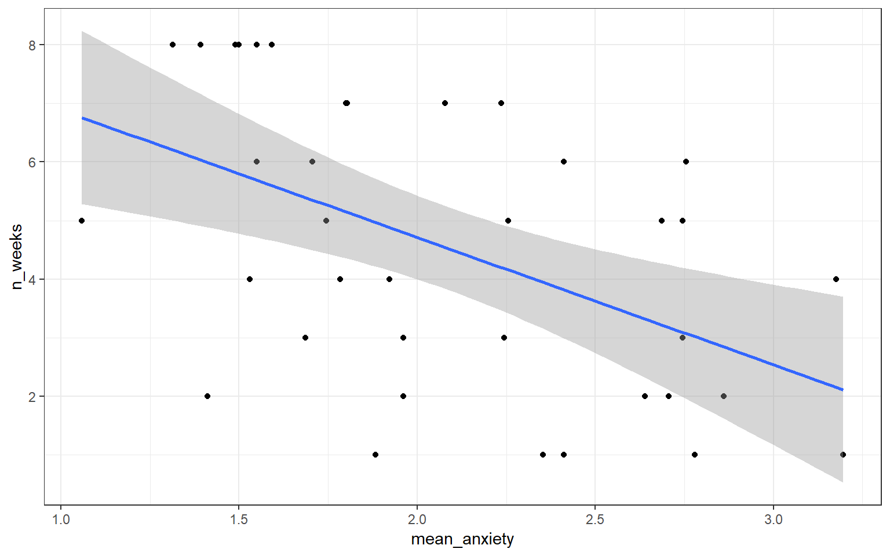
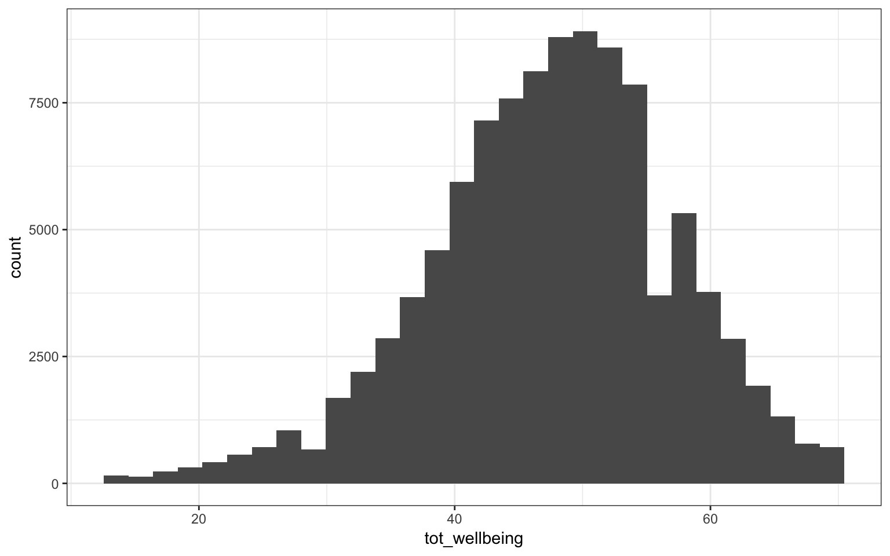
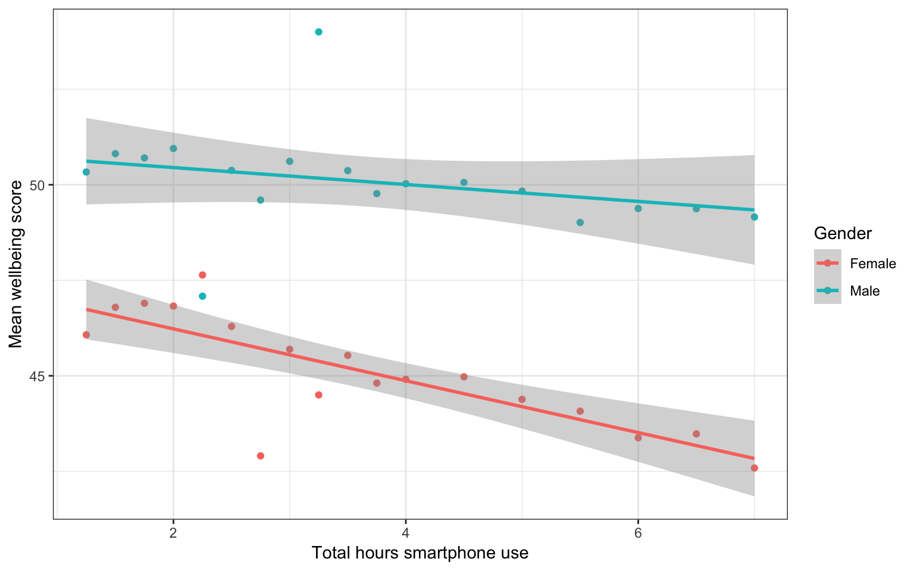
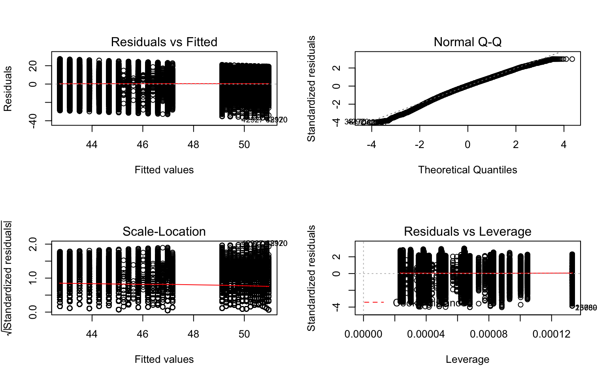

# RM2 Regression

## Pre-class activities

In this activity, you will be working with real data and using regression to explore the question of whether there is a relationship between statistics anxiety and engagement in course activities.  The hypothesis is that students who are more anxious about statistics are less likely to engage in course-related activities. This avoidance behaviour could ultimately be responsible for lower performance for these students (although we won't be examining the assessment scores in this activity).

We are going to analyse data from the STARS Statistics Anxiety Survey, which was administered to students in the third-year statistics course in Psychology at the University of Glasgow. All the responses have been anonymised by associating the responses for each student with an arbitrary ID number (integer).

The STARS survey (Cruise, Cash, & Bolton, 1985) is a 51-item questionnaire, with each response on a 1 to 5 scale, with higher numbers indicating greater anxiety.

Cruise, R. J., Cash, R. W., & Bolton, D. L. (1985). Development and validation of an instrument to measure statistical anxiety. *Proceedings of the American Statistical Association, Section on Statistical Education*, Las Vegas, NV.


As a measure of engagement in the course, we will use data from Moodle usage analytics. Over the course of the term, there were eight optional weekly on-line sessions that students could attend for extra support. The variable `n_weeks` in the `psess.csv` file tells you how many (out of eight) a given student attended.

Our hypothesis was that greater anxiety would be reflected in lower engagement.  Answer the following question.

If our hypothesis is correct then there should be <select class='solveme' data-answer='["a negative"]'> <option></option> <option>a positive</option> <option>no</option> <option>a negative</option></select> correlation between students' mean anxiety levels and `n_weeks`.

### Activity 1: Setup

Do the following. If you need help, consult Chapter @\ref(ref3) and Chapter \@(ref2).

* Open R Studio and set the working directory to your RM2 Chapter 9 folder. Ensure the environment is clear.   
* Open a new R Markdown document and save it in your working directory. Call the file "Chapter 9 Pre-class".    
* Download `L3_stars.csv` and `psess.csv`. from Moodle and save them in your Chapter 9 folder. Make sure that you do not change the file name at all.    
* Delete the default R Markdown welcome text and insert a new code chunk that loads `pwr`, `car`, `broom`, and `tidyverse` using the `library()` function.
* Load the two CSV datasets into variables called `stars` and `engage` using `read_csv()`.


### Activity 2: Tidy the data

* Take a look at both of the datasets you loaded in (you can use just type the name to output them out to the console).

The next thing we need to do is to calculate a mean anxiety score for each student (recall that individual students are identified by the `ID` variable).

Recall the difference between *wide* and *tidy* data. In wide data, each row represents an individual case, with observations for that case in separate columns; in tidy data, each row represents a single observation, and the observations are grouped together into cases based on the value of a variable (for these data, the `ID` variable).

* The STARS data are currently in <select class='solveme' data-answer='["wide"]'> <option></option> <option>wide</option> <option>tidy</option></select> format.

Before we calculate means, you need to use `gather()` to restructure the STARS data into the appropriate "tidy" format; i.e., so that it looks like the table below.


 ID    Question    Score 
----  ----------  -------
 3       Q01         1   
 3       Q02         1   
 3       Q03         1   
 3       Q04         1   
 3       Q05         1   
 3       Q06         1   

* Write and run the code to do tidy the STARS data, and store the resulting table as `stars2`.


### Activity 3: Calculate mean anxiety for each student

* Now that you've got the data into a tidy format, use `summarise()` and `group_by()` to calculate mean anxiety scores (`mean_anxiety`) for each student (`ID`). Store the resulting table in a variable named `stars_means`. 


### Activity 4: Join the datasets together

* In order to perform the regression analysis, combine the data from `stars_means` with `engage` using `inner_join()`. Call the resulting table `joined`. It should look like this:


### Activity 5: Calculate descriptives for the variables overall

It is also useful to calculate descriptives statistics for the sample overall so that you can check that the sample scores are what you were expecting (e.g., are they comparable to previous studies and samples?). This is also useful for the write-up.

* Run the below code. Read each line and ensure you understand what is being calculated.


```r
descriptives <- joined %>%
  summarise(mean_anx = mean(mean_anxiety, na.rm = TRUE),
            min_anx = mean(mean_anxiety,na.rm = TRUE) - qnorm(0.975)*sd(mean_anxiety,na.rm = TRUE)/sqrt(n()), 
            max_anx = mean(mean_anxiety,na.rm = TRUE) + qnorm(0.975)*sd(mean_anxiety,na.rm = TRUE)/sqrt(n()),
            sd_anx = sd(mean_anxiety, na.rm = TRUE),
            mean_weeks = mean(n_weeks, na.rm = TRUE),
            min_weeks = mean(n_weeks) - qnorm(0.975)*sd(n_weeks,na.rm = TRUE)/sqrt(n()), 
            max_weeks = mean(n_weeks) + qnorm(0.975)*sd(n_weeks,na.rm = TRUE)/sqrt(n()),
            sd_weeks = sd(n_weeks, na.rm = TRUE))
```


### Activity 6: Visualisations

* Now that youwe have all of the variables in one place, write the code to reproduce the exact scatterplot below (using ggplot2).

<div class="figure" style="text-align: center">

<p class="caption">(\#fig:scatter)Scatteplot of mean anxiety and attendance</p>
</div>

* According to the scatterplot, <select class='solveme' data-answer='["as anxiety increases, engagement decreases"]'> <option></option> <option>there is no apparent relationship</option> <option>as anxiety increases, engagement decreases</option> <option>as anxiety increases, engagement increases</option></select>


### Activity 7: Run the regression

The `lm()` function from Base R is the main function to estimate a *L*inear *M*odel (hence the function name `lm`). `lm()` uses formula syntax that you have seen before, i.e., `DV ~ predictor`.  

* Use the `lm()` function to predict `n_weeks` (DV) from `mean_anxiety` (predictor).  Store the result of the call to `lm()` in the variable `mod`.  To see the results, use `summary(mod)`.


```r
mod <- lm(n_weeks ~ mean_anxiety, joined)
mod_summary <- summary(mod)
```

Answer the following questions about the model. You may wish to refer to the lecture notes to help you answer these questions.

1. The estimate of the y-intercept for the model, rounded to three decimal places, is <input class='solveme nospaces' size='5' data-answer='["9.057"]'/>
2. To three decimal places, if the GLM for this model is $Y_i = \beta_0 + \beta_1 X_i + e_i$, then $\beta_1$ is <input class='solveme nospaces' size='6' data-answer='["-2.173"]'/>
3. To three decimal places, for each unit increase in anxiety, `n_weeks` decreases by <input class='solveme nospaces' size='5' data-answer='["2.173"]'/>
4. To two decimal places, what is the overall F-ratio of the model? <input class='solveme nospaces' size='5' data-answer='["11.99"]'/>
5. Is the overall model significant? <select class='solveme' data-answer='["Yes"]'> <option></option> <option>Yes</option> <option>No</option></select>
6. What proportion of the variance does the model explain? <input class='solveme nospaces' size='5' data-answer='["23.39"]'/>


<div class='solution'><button>Explain these answers</button>

1. In the summary table, this is the estimate of the intercept.
2. In the summary table, this is the estimate of mean_anxiety, i.e., the slope.
3. In the summary table, this is also the estimate of mean_anxiety, the slope is how much it decreases so you just remove the - sign. 
4. In the summary table, the F-ratio is noted as he F-statistic.
5. The overall model p.value is .001428 which is less than .05, therefore significant. 
6. The variance explained is determined by R-squared, you simply multiple it by 100 to get the percent. You should always use the adjusted R-squared value.
    

</div>
  
<br>

### Activity 8: Assumption checking

It's now time to check the assumptions, which for regression are a little bit more involved than they were for ANOVA.

1. The outcome/DV is a interval/ratio level data 
2. The predictor variable is interval/ratio or categorical (with two levels)
3. All values of the outcome variable are independent (i.e., each score should come from a different participant)
4. The predictors have non-zero variance
5. The relationship between outcome and predictor is linear
6. The residuals should be normally distributed
7. There should be homoscedasticity (homogeneity of variance, but for the residuals)

Assumptions 1-3 are nice and easy. We know this from the data we have and the design of the study. Assumption 4 simply means that there is some spread in the data - for example, there's no point running a regression with age as a variable if all your participants are 20 years old. We can check this using the scatterplot we created in Activity 4 and we can see that this assumption is met, we do indeed have a spread of scores. 

Assumption 5 could also be checked with the scatterplot but there are some nice regression-specific functions from `car` that we can use.

* Run the below code. It will produce the scatterplot with a linear line and the line that best fits the data. If these two lines are quite similar (they will never be perfect) then you can assume linearity.


```r
crPlots(mod)
```

Assumption 6 can be tested as we have done before with a qqplot and a Shapiro-Wilk test.


```r
qqPlot(mod$residuals)
```

<div class="figure" style="text-align: center">

<p class="caption">(\#fig:normality)qqplot for residuals</p>
</div>

```r
shapiro.test(mod$residuals)
```

```
## [1] 13 11
## 
## 	Shapiro-Wilk normality test
## 
## data:  mod$residuals
## W = 0.91652, p-value = 0.008764
```

The qqplot doesn't look too bad, on the basis of this alone we would probably assume normality. However, the Shapiro-Wilk test is significant which suggests something isn't quite right. The Shaprio-Wilk has been criticised for rejecting the null hypothesis (i.e., concluding that the data are not normal) too often and it's argued that if the qqplot and the Shapiro test disagree, it's better to rely on the qqplot. There is a good discussion [about it here](https://stats.stackexchange.com/questions/2492/is-normality-testing-essentially-useless) if you'd like to know more. For now, we will proceed cautiously and check the final assumption before we make a decision about what to do.

The final assumption of homoscedasticity means that the error in the model is fairly constant at all points (i.e., if you looked at the scatterplot, the data points wouldn't be bunched together at one end and spread out at the other). We can test this using the non-constant error variance test from `car`.

* Run the below code. If the test is significant, the assumption has been violated. Based upon the results, can we assume homoscedasticity? <select class='solveme' data-answer='["Yes"]'> <option></option> <option>Yes</option> <option>No</option></select>


```r
ncvTest(mod)
```

Returning to the issue of normality, all of the other assumptions have been met and the qqplot suggests that any deviation from normality is very mild. Based upon this evidence, it seems justified to proceed with the original regression.

### Activity 9: Power and effect size

First we can calculate the minimum effect size we were able to detect given the sample size and design of the study using `pwr.f2.test()`. As usual, we fill in all the information we have and set the effect size argument, in this case `f2`, to `NULL`.


```r
pwr.f2.test(u = 1, v = 35, f2 = NULL, sig.level = .05, power = .8)
```

* Based on the power analysis, what is the minimum effect size we were able to detect rounded to 2 decimal places? <input class='solveme nospaces' size='0.22' data-answer='[".22"]'/>  
* According to Cohen's guidelines, this would be a <select class='solveme' data-answer='["Medium"]'> <option></option> <option>Small</option> <option>Medium</option> <option>Large</option></select> effect.

There is no formula to calculate our observed f^2^, we must do it manually using the formula from the lecture.


```r
f2 <- mod_summary$adj.r.squared/(1 - mod_summary$adj.r.squared)
```

* Is the observed effect size larger than the minimum effect size we could detect? <select class='solveme' data-answer='["Yes, our study is sufficiently powered"]'> <option></option> <option>Yes, our study is sufficiently powered</option> <option>No, our study is underpowered</option></select>

### Activity 10: Write-up

We need to manually calculate the p-value for the inline coding as you can't extract it from the `lm()` model. Run the below code to do this.


```r
f <-mod_summary$fstatistic
mod_p <- pf(f[1], f[2], f[3], lower=FALSE) 
```

Now, copy and paste the below code into **white-space** and knit the document.


```r
A simple linear regression was performed with engagment (M = `r descriptives$mean_weeks %>% round(2)`, SD = `r descriptives$sd_anx %>% round(2)`) as the outcome variable and statistics anxiety (M = `r descriptives$mean_anx %>% round(2)`, SD = `r descriptives$sd_anx %>% round(2)`) as the predictor variable. The results of the regression indicated that the model significantly predicted course engagement (F(`r mod_summary$fstatistic[2]`, `r mod_summary$fstatistic[3]`) = `r mod_summary$fstatistic[1] %>% round(2)`, p < .001, Adjusted R2 = `r mod_summary$adj.r.squared %>% round(2)`, f2 = .63), accounting for `r (mod_summary$adj.r.squared %>% round(2))*100`% of the variance. Anxiety was a significant positive predictor (β = `r mod$coefficients[2] %>% round(2)`, p < `mod_p %>% round(3)`.
)
```

A simple linear regression was performed with engagement (M = 4.54, SD = 0.56) as the outcome variable and statistics anxiety (M = 2.08, SD = 0.56) as the predictor variable. The results of the regression indicated that the model significantly predicted course engagement (F(1, 35) = 11.99, p < .001, Adjusted R2 = 0.23, f^2^ = .63), accounting for 23% of the variance. Anxiety was a significant positive predictor (β = -2.17, p < 0.001.
)


### Activity solutions

#### Activity 1

<div class="solution"><button>Activity 1</button>

```r
library("pwr")
library("rcompanion")
library("car")
library("broom")
library("afex")
library("emmeans")
library("tidyverse")
```
</div>

** Click tab to see solution **

#### Activity 2

<div class="solution"><button>Activity 2</button>

```r
library("pwr")
stars2 <- gather(stars, "Question", "Score", Q01:Q51) %>%
  arrange(ID)
head(stars2) %>% knitr::kable(align = 'c')
```
</div>

** Click tab to see solution **

#### Activity 3

<div class="solution"><button>Activity 3</button>

```r
stars_means <- stars2 %>%
  group_by(ID) %>%
  summarise(mean_anxiety = mean(Score, na.rm = TRUE),
            min = mean(Score) - qnorm(0.975)*sd(Score)/sqrt(n()), 
            max = mean(Score) + qnorm(0.975)*sd(Score)/sqrt(n()),
            sd = sd(Score))
```
</div>

** Click tab to see solution **

#### Activity 4

<div class="solution"><button>Activity 4</button>

```r
joined <- inner_join(stars_means, engage, "ID")
```
</div>

** Click tab to see solution **

#### Activity 5

<div class="solution"><button>Activity 5</button>

```r
ggplot(joined, aes(mean_anxiety, n_weeks)) +
  geom_point() +
  geom_smooth(method = "lm")
```
</div>

** Click tab to see solution **

## In-class activities


### Screen time and well-being

There is currently much debate (and hype) surrounding smartphones and their effects on well-being, especially with regard to children and teenagers.  We'll be looking at data from this recent study of English adolescents:

> Przybylski, A. & Weinstein, N. (2017). A Large-Scale Test of the Goldilocks Hypothesis. *Psychological Science*, *28*, 204--215.

This was a large-scale study that found support for the "Goldilocks" hypothesis among adolescents: that there is a "just right" amount of screen time, such that any amount more or less than this amount is associated with lower well-being.  This was a huge survey study: the data contain responses from over 120,000 participants! 

Fortunately, the authors made the data from this study openly available, which allows us to dig deeper into their results. In this exercise, we will look at whether the relationship between screen time and well-being is modulated by participants' (self-reported) gender.

The dependent measure used in the study was the [Warwick-Edinburgh Mental Well-Being Scale (WEMWBS)](https://warwick.ac.uk/fac/med/research/platform/wemwbs/). This is a 14-item scale with 5 response categories, summed together to form a single score ranging from 14-70.

At [Przybylski & Weinstein's page for this study on the Open Science Framework](https://osf.io/82ybd/), you can find the [participant survey](https://osf.io/82ybd/) which asks a large number of additional questions (see page 14 for the WEMWBS questions and pages 4-5 for the questions about screen time). Within the same page you can also find the [raw data](https://osf.io/82ybd/); however, for the purpose of this exercise, you will be using local pre-processed copies of the data which can be downloaded from Moodle.

Przybylski and Weinstein looked at multiple measures of screen time, but we will be focusing on smartphone use.  They found that decrements in well-being started to appear when respondents reported more than one hour of weekly smartphone use.  Our question: Does the negative association between hours of use and well-being (beyond the one-hour point) differ for boys and girls?

Note that in this analysis, we have:

- a continuous$^*$ DV, well-being;

- a continuous$^*$ predictor, screen time;

- a categorical predictor, gender.

$^*$these variables are only quasi-continuous, inasmuch as only discrete values are possible. However, there are a sufficient number of discrete categories that we can treat them as effectively continuous.

What we want to do is to estimate two slopes relating screen time to well-being, one for girls and one for boys, and then statistically compare these slopes. So this problem seems simultaneously like a situation where you would run a regression (to estimate the slopes) but also one where you would need a t-test (to compare two groups).

But the expressive power of regression allows us to do this all within a single model. As the [Bishop blog showed](http://deevybee.blogspot.com/2017/11/anova-t-tests-and-regression-different.html), *an independent groups t-test is just a special case of ordinary regression with a single categorical predictor; ANOVA is just a special case of regression where all predictors are categorical.*  So although we can express any ANOVA design using regression, the converse is not true: we cannot express every regression design in ANOVA. Regression allows us to have any combination of continuous and categorical predictors in the model. The only inconvenience with running ANOVA models as regression models is that you have to take care in how you numerically code the categorical predictors.

### Activity 1: Set-up

* Open R Studio and set the working directory to your RM2 Chapter 9 folder. Ensure the environment is clear.    
* Open a new R Markdown document and save it in your working directory. Call the file "Chapter 9 In-class".    
* Download <a href="wellbeing.csv" download>wellbeing.csv</a>, <a href="participant_info.csv" download>participant_info.csv</a> and <a href="screen_time.csv" download>screen_time.csv</a> and save them in your Chapter 9 folder. Make sure that you do not change the file names at all.    
* Delete the default R Markdown welcome text and insert a new code chunk that loads `pwr`, `car`, `broom`, and `tidyverse` using the `library()` function.
* Load the CSV datasets into variables called `pinfo`, `wellbeing` and `screen` using `read_csv()`.


### Activity 2: Look at the data

Take a look at the resulting tibbles `pinfo`, `wellbeing`, and `screen`.  The `wellbeing` tibble has information from the WEMWBS questionnaire; `screen` has information about screen time use on weekends (variables ending with `we`) and weekdays (variables ending with `wk`) for four types of activities: using a computer (variables starting with `Comph`; Q10 on the survey), playing video games (variables starting with `Comp`; Q9 on the survey), using a smartphone (variables starting with `Smart`; Q11 on the survey) and watching TV (variables starting with `Watch`; Q8 on the survey).  If you want more information about these variables, look at the items 8-11 on pages 4-5 of the the [PDF version of the survey on the OSF website](https://osf.io/82ybd/).

* The variable corresponding to *gender* is located in the table named <select class='solveme' data-answer='["pinfo"]'> <option></option> <option>pinfo</option> <option>wellbeing</option> <option>screen</option></select> and this variable is called <input class='solveme nospaces' size='6' data-answer='["male"]'/>.

* The WEMWBS data is in <select class='solveme' data-answer='["wide"]'> <option></option> <option>long</option> <option>wide</option></select> format, and contains observations from <input class='solveme nospaces' size='10' data-answer='["102580","102,580"]'/> participants on <input class='solveme nospaces' size='2' data-answer='["15"]'/> items.

* Individual participants in this dataset are identified by the variable named <input class='solveme nospaces' size='9' data-answer='["Serial"]'/> [be sure to type the name *exactly*, including capitalization].  This variable will allow us to link information across the three tables.

* Run `summary()` on the three data-sets. Are there any missing data points? <select class='solveme' data-answer='["No"]'> <option></option> <option>Yes</option> <option>No</option></select>


### Activity 3: Compute the well-being score for each respondent

The WEMWBS well-being score is simply the *sum* of all the items. 

* Write the code to create a new table called `wemwbs`, with two variables: `Serial`, and `tot_wellbeing`, the total WEMWBS score.


<div class='solution'><button>Hint</button>

- "gather" the table from wide to long

</div>


<div class='solution'><button>Another Hint</button>

- `group_by()`; `summarise(tot_wellbeing = ...)`

</div>


**Sanity check:** Verify for yourself that the scores all fall in the 14-70 range.  Przybylski and Weinstein reported a mean of 47.52 with a standard deviation of 9.55. Can you reproduce these values?


<div class='solution'><button>Hint</button>

- `summarise()`, `min()`, `max()`

</div>

<br>
* Now visualise the distribution of `tot_wellbeing` in a histogram using ggplot2.


<div class='solution'><button>Hint</button>

- `geom_histogram()`

</div>


<div class='solution'><button>Solution</button>


```r
ggplot(wemwbs, aes(tot_wellbeing)) + geom_histogram() 
```

```
## `stat_bin()` using `bins = 30`. Pick better value with `binwidth`.
```

<div class="figure" style="text-align: center">

<p class="caption">(\#fig:wemwbs_histogram)**CAPTION THIS FIGURE!!**</p>
</div>


</div>


The distribution of well-being scores is <select class='solveme' data-answer='["negatively skewed"]'> <option></option> <option>symmetric</option> <option>negatively skewed</option> <option>positively skewed</option></select>.

### Activity 4: Visualise the relationship

Let's take a quick look at the relationship between screen time (for the four different technologies) and measures of well-being.  Here is code to do this. 

* Run the below code and try and explain in words what each line of code is doing (remember, pronounce `%>%` as "and then"). You may find it easier to look at each of the tables that are produced.


```r
screen_long <- screen %>%
  gather("var", "hours", -Serial) %>%
  separate(var, c("variable", "day"), "_")

screen2 <- screen_long %>%
  mutate(variable = dplyr::recode(variable,
               "Watch" = "Watching TV",
               "Comp" = "Playing Video Games",
               "Comph" = "Using Computers",
               "Smart" = "Using Smartphone"),
     day = dplyr::recode(day,
              "wk" = "Weekday",
              "we" = "Weekend"))

dat_means <- inner_join(wemwbs, screen2, "Serial") %>%
  group_by(variable, day, hours) %>%
  summarise(mean_wellbeing = mean(tot_wellbeing))

ggplot(dat_means, aes(hours, mean_wellbeing, linetype = day)) +
  geom_line() +
  geom_point() +
  facet_wrap(~variable, nrow = 2)
```

<div class="figure" style="text-align: center">

<p class="caption">(\#fig:combined)Relationship between wellbeing and screentime usage by technology and weekday</p>
</div>

The graph makes it evident that smartphone use of more than 1 hour per day is associated with increasingly negative well-being.  Note that we have combined the tables using an `inner_join()`, such that we only include data for which we have observations across the `wemwbs` and `screen2` tables.

In the next step, we are going to focus in on the smartphone/well-being relationship.

### Activity 5: Smartphone and well-being for boys and girls

For this analysis, we are going to collapse weekday and weekend use for smartphones.

* Create a new table, `smarttot`, that has the that has mean number of hours per day of smartphone use for each participant, averaged over weekends/weekdays. 
* You will need to filter the dataset to only include smartphone use and not other technologies. 
* You will also need to group the results by the participant ID (i.e., `serial`). 
* The final data-set should have two variables: `Serial` (the participant) and `hours_per_day`.
* You will need to use the data-set `screen2` to do this.

<br>

* Next, create a new tibble called `smart_wb` that only includes (filters) participants from `smarttot` who used a smartphone for more than one hour per day each week, and then combine (join) this table with the information in `wemwbs` and `pinfo`.**


### Activity 6: Mean-centering variables

As discussed in the lecture, When you have continuous variables in a regression, it is often sensible to transform them by *mean centering*.  You mean center a predictor `X` simply by subtracting the mean (`X_centered = X - mean(X)`). This has two useful consequences:

- the model intercept reflects the prediction for $Y$ at the mean value of the predictor variable, rather than at the zero value of the unscaled variable;

- if there are interactions in the model, any lower-order effects can be given the same interpretation as they receive in ANOVA (main effects, rather than simple effects).

For categorical predictors with two levels, these become coded as -.5 and .5 (because the mean of these two values is 0).

* Use `mutate` to add two new variables to `smart_wb`: `tothours_c`, calculated as a mean-centered version of the `tothours` predictor; and `male_c`, recoded as -.5 for female and .5 for male.
* To create `male_c` you will need to use `if_else(male == 1, .5, -.5)` You can read this code as "if the variable `male` equals 1, recode it as .5, if not, recode it as -.5".
* Finally, recode `male` and `male_c` as factors, so that R knows not to treat them as a real numbers.


### Activity 7: Visualise the relationship

* Reverse-engineer the below plot. Calculate mean well-being scores for each combination of `male` and `tothours`, and then create a scatterplot plot that includes separate regression lines for each gender.
* You may find it useful to refer to Chapter \@ref(vis). 

<div class="figure" style="text-align: center">

<p class="caption">(\#fig:plots)Relationship between mean wellbeing and smartphone use by gender</p>
</div>


Write an interpretation of the above plot in plain English.


<div class='solution'><button>Possible solution</button>

Girls show lower overall well-being compared to boys.  In addition, the slope for girls appears more negative than that for boys; the one for boys appears relatively flat.  This suggests that the negative association between well-being and smartphone use is stronger for girls.

</div>


### Activity 8: Running the regression

Now we're going to see if there is statistical support for our above interpretation of the graph.

For the data in `smart_wb`, use the `lm()` function to calculate the multiple regression model:

$Y_i = \beta_0 + \beta_1 X_{1i}  + \beta_2 X_{2i}  + \beta_3 X_{3i} + e_i$

where

- $Y_i$ is the well-being score for participant $i$;
- $X_{1i}$ is the mean-centered smartphone use variable for participant $i$;
- $X_{2i}$ is gender (-.5 = female, .5 = male);
- $X_{3i}$ is the interaction between smartphone use and gender ($= X_{1i} \times X_{2i}$)

Then use `summary()` to view the results and store this in an object called `mod_summary()`.


<div class='solution'><button>Hint</button>

- R formulas look like this: `y ~ a + b + a:b` where `a:b` means interaction

</div>


* The interaction between smartphone use and gender is shown by the variable <select class='solveme' data-answer='["thours_c:male_c"]'> <option></option> <option>thours_c</option> <option>male_c</option> <option>thours_c:male_c</option></select>, and this interaction was <select class='solveme' data-answer='["significant"]'> <option></option> <option>significant</option> <option>nonsignificant</option></select> at the $\alpha = .05$ level.

* To 2 decimal places, what proportion of the variance in well-being scores does the overall model explain? <input class='solveme nospaces' size='4' data-answer='["9.38"]'/>

* The p-value for the overall model fit is `< 2.2e-16`. Is this significant? <select class='solveme' data-answer='["Yes"]'> <option></option> <option>Yes</option> <option>No</option></select>

* What is the most reasonable interpretation of these results? <select class='solveme' data-answer='["smartphone use was more negatively associated with wellbeing for girls than for boys"]'> <option></option> <option>smartphone use harms girls more than boys</option> <option>smartphone use harms boys more than girls</option> <option>there is no evidence for gender differences in the relationship between smartphone use and well-being</option> <option>smartphone use was more negatively associated with wellbeing for girls than for boys</option></select>

### Activity 9: Assumption checking

Now it's time to test those pesky assumptions. The assumptions for multiple regression are the same as simple regression but there is one additional assumption, that of multicollinearity, the idea that predictor variables should not be too highly correlated.

1. The outcome/DV is a interval/ratio level data 
2. The predictor variable is interval/ratio or categorical (with two levels)
3. All values of the outcome variable are independent (i.e., each score should come from a different participant)
4. The predictors have non-zero variance
5. The relationship between outcome and predictor is linear
6. The residuals should be normally distributed
7. There should be homoscedasticity (homogeneity of variance, but for the residuals)
8. Multicollinearity: predictor variables should not be too highly correlated

From the work we've done so far we know that assumptions 1 - 4 are met. Unlike when we did simple regression we can't use `crPlots()` to test for linearity when there is an interaction, but we know from looking at the grouped scatterplot that this assumption has been met.

Normally we would test for normality with a qqplot and a Shapiro-Wilk test. However, because this dataset is so large, the Shapiro-Wilk is not appropriate (if you try to run the test it will produce a warning telling you that the sample size must be between 3 and 5000). This is because as we have mentioned before, with extremely large sample sizes the Shapiro-Wilk test will find that any deviation from normality is significant. Therefore we should judge normality based upon the qqplots.

* Create a qqplot of the model residuals. Can we assume normality? <select class='solveme' data-answer='["Yes"]'> <option></option> <option>Yes</option> <option>No</option></select>

We also have this problem for testing homoscedasticity with `ncvTest()` so we need to rely on plots again. To check for homoscedasticity we can use `plot()` from Base R that will produce a bunch of helpful plots ([more information here](https://www.r-bloggers.com/how-to-detect-heteroscedasticity-and-rectify-it/)). The residuals vs leverage plot shows a flat red line so, whilst it isn't perfect, we can assume that with such a large sample size regression is still an appropriate analysis. 


```r
par(mfrow=c(2,2)) # 4 charts in 1 panel
plot(mod)
```

<div class="figure" style="text-align: center">

<p class="caption">(\#fig:plots2)Regression assumption plots</p>
</div>

Finally, to check for multicollinearity we can use `vif()` to calculate the variance inflation factor. Essentially, this function estimates how much the variance of a coefficient is “inflated” because of linear dependence with other predictors, i.e., that a predictor isn't actually adding any unique variance to the model, it's just really strongly related to other predictors. [You can read more about this here](https://statisticalhorizons.com/multicollinearity). Thankfully, VIF is not affected by large samples like the other tests.

There are various rules of thumb, but most converge on a VIF of above 2 - 2.5 for any one predictor being problematic.

* Run the below code. Do any of the predictors show evidence of multicollinearity? <select class='solveme' data-answer='["There is no evidence of multicollinearity"]'> <option></option> <option>thours_c</option> <option>male_c</option> <option>thours_c:male_c</option> <option>There is no evidence of multicollinearity</option></select>


```r
vif(mod)
```

### Activity 10: Power and effect size

Finally, we'll calculate power and effect size as usual.

* Using the code from the pre-class activity calculate the minimum effect size we could reliably observe given our sample size and design but for 99% power. Report this to 2 decimal places <input class='solveme nospaces' size='0.00' data-answer='[".00"]'/>


* What is the observed effect size for the study to 2 decimal places? <input class='solveme nospaces' size='0.10' data-answer='[".10"]'/>  
* Is the study sufficiently powered? <select class='solveme' data-answer='["Yes"]'> <option></option> <option>Yes</option> <option>No</option></select>

### Activity 11: Write-up

Now, copy and paste the below code into **white-space** and then knit the document. Note that the p-values are entered manually because of the APA `p < .001` formatting.


```r
All continuous predictors were mean-centered and deviation coding was used for categorical predictors. The results of the regression indicated that the model significantly predicted course engagement (F(`r mod_summary$fstatistic[2]`, `r mod_summary$fstatistic[3] %>% round(2)`) = `r mod_summary$fstatistic[1] %>% round(2)`, p < .001, Adjusted R2 = `r mod_summary$adj.r.squared %>% round(2)`, f^2^ = .63), accounting for `r (mod_summary$adj.r.squared %>% round(2))*100`% of the variance. Total screen time was a significant negative predictor of wellbeing scores (β = `r mod$coefficients[2] %>% round(2)`, p < .001, as was gender (β = `r mod$coefficients[3] %>% round(2)`, p < .001, with girls having lower wellbeing scores than boys. Importantly, there was a significant interaction between screentime and gender (β = `r mod$coefficients[4] %>% round(2)`, p < .001), smartphone use was more negatively associated with wellbeing for girls than for boys. 
```

> All continuous predictors were mean-centered and deviation coding was used for categorical predictors. The results of the regression indicated that the model significantly predicted course engagement (F(3, 7.1029\times 10^{4}) = 2450.89, p < .001, Adjusted R2 = 0.09, f2 = .63), accounting for 9% of the variance. Total screen time was a significant negative predictor of well-being scores (β = -0.77, p < .001, as was gender (β = 5.14, p < .001, with girls having lower well-being scores than boys. Importantly, there was a significant interaction between screen time and gender (β = 0.45, p < .001), smartphone use was more negatively associated with well-being for girls than for boys.

### Finished!

And you're done! Not just with this week but with the R component of RM2! Well, aside from the final portfolio worksheet. The progress that you have made is truly astonishing. Even if you struggled with R and haven't quite understood every single line of code we've shown, what you're capable of with data wrangling and visualisation alone makes you some of the most highly competitive psychology graduates in the world. 

Regardless of whether you continue with quantitative methods and using R, remember the more important critical skills that you have learned as part of this process. The next time you see a dataset or you see data being talked about in the news, think about all work that was put into getting the data into the final format. More importantly, think about all the decisions that the researcher needed to make along the way and how that might have affected the outcome. 

 

### Activity solutions

#### Activity 3

<div class="solution"><button>Activity 3</button>

```r
wemwbs <- wellbeing %>%
  gather("var", "score", -Serial) %>%
  group_by(Serial) %>%
  summarise(tot_wellbeing = sum(score))

# sanity check values

wemwbs %>% summarise(mean = mean(tot_wellbeing),
                     sd = sd(tot_wellbeing),
                     min = min(tot_wellbeing), 
                     max = max(tot_wellbeing))
```
</div>

#### Activity 5

<div class="solution"><button>Activity 5</button>

```r
smarttot <- screen2 %>%
  filter(variable == "Using Smartphone") %>%
  group_by(Serial) %>%
  summarise(tothours = mean(hours))

smart_wb <- smarttot %>%
  filter(tothours > 1) %>%
  inner_join(wemwbs, "Serial") %>%
  inner_join(pinfo, "Serial") 
```
</div>

#### Activity 6

<div class="solution"><button>Activity 6</button>

```r
smart_wb <- smarttot %>%
  filter(tothours > 1) %>%
  inner_join(wemwbs, "Serial") %>%
  inner_join(pinfo, "Serial") %>%
  mutate(thours_c = tothours - mean(tothours),
         male_c = ifelse(male == 1, .5, -.5))
```
</div>

#### Activity 7

<div class="solution"><button>Activity 7</button>

```r
smart_wb_gen <- smart_wb %>%
  group_by(tothours, male) %>%
  summarise(mean_wellbeing = mean(tot_wellbeing))

ggplot(smart_wb_gen, aes(tothours, mean_wellbeing, color = male)) +
  geom_point() +
  geom_smooth(method = "lm") +
  scale_color_discrete(name = "Gender", labels = c("Female", "Male"))+
  scale_x_continuous(name = "Total hours smartphone use") +
  scale_y_continuous(name = "Mean well-being score")
```
</div>

#### Activity 8

<div class="solution"><button>Activity 8</button>

```r
mod <- lm(tot_wellbeing ~ thours_c * male_c, smart_wb)
# alternatively: 
# mod <- lm(tot_wellbeing ~ thours_c + male_c + thours_c:male_c, smart_wb)

mod_summary <- summary(mod)
```
</div>

#### Activity 9

<div class="solution"><button>Activity 9</button>

```r
qqPlot(mod$residuals)
```
</div>

#### Activity 10

<div class="solution"><button>Activity 9</button>

```r
pwr.f2.test(u = 3, v = 71029, f2 = NULL, sig.level = .05, power = .99)
f2 <- mod_summary$adj.r.squared/(1 - mod_summary$adj.r.squared)
```
</div>
